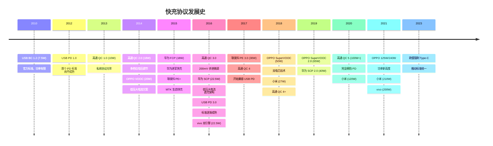
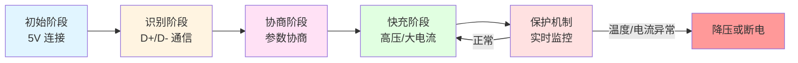
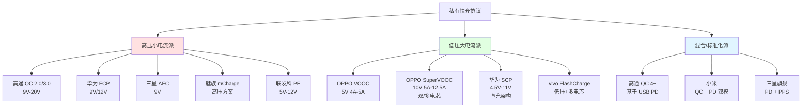
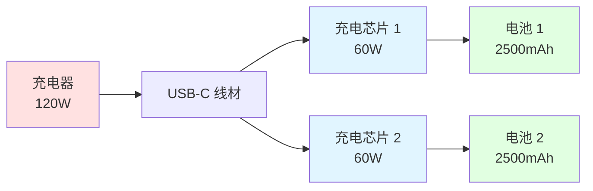
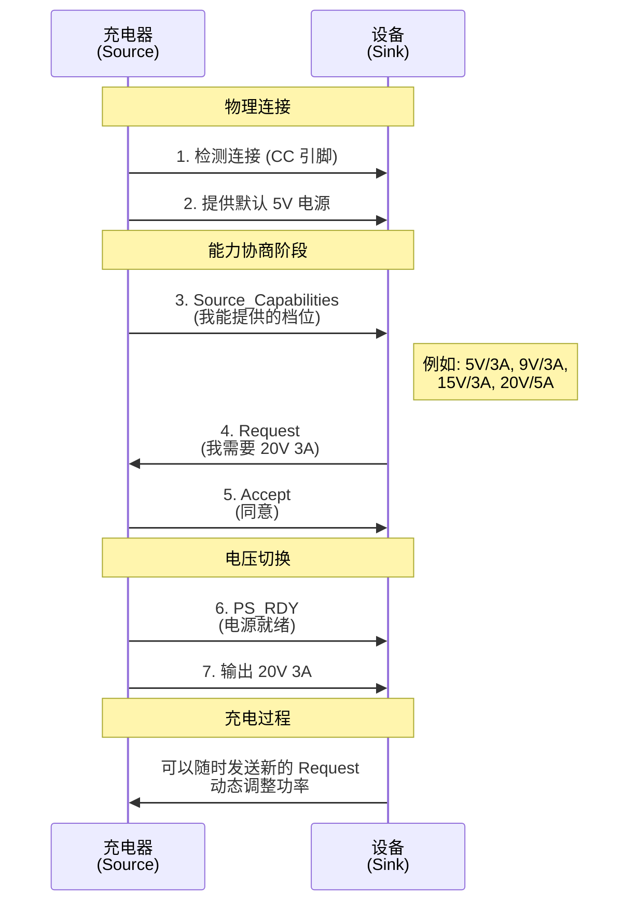
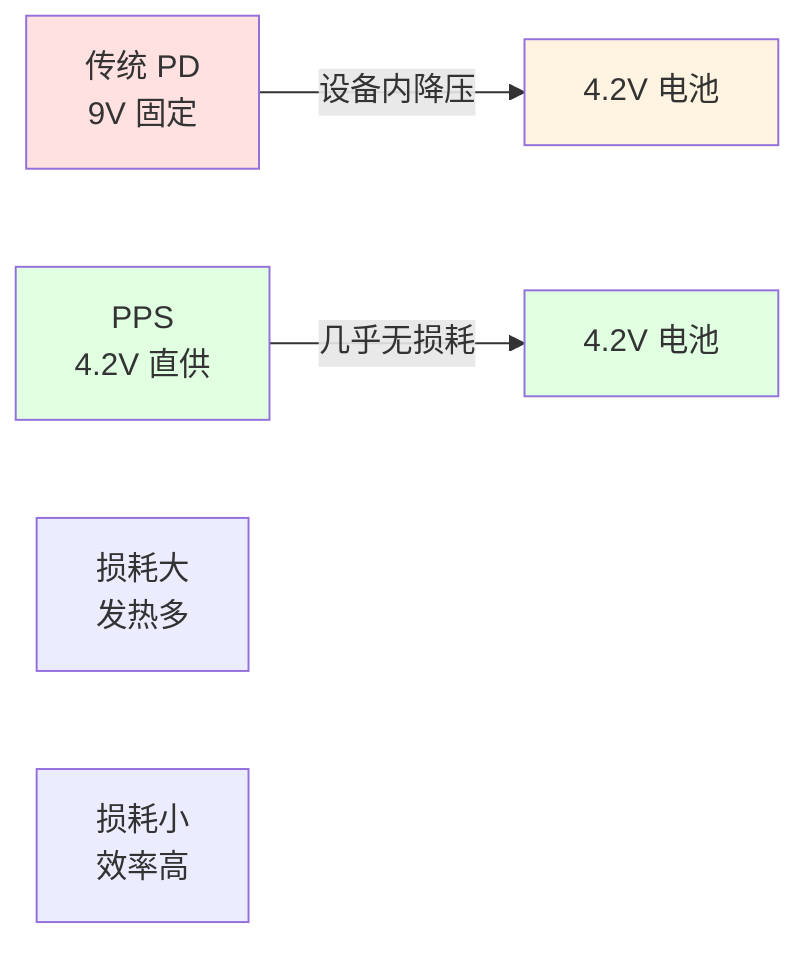
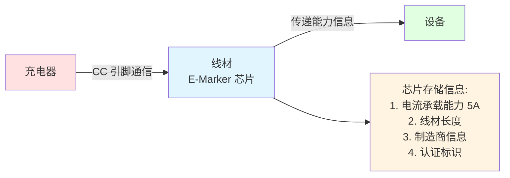

# 第 5 章：充电与供电 (Charging & Power Delivery)

USB 接口的供电能力从最初的 2.5W (5V 0.5A) 发展到了现在的 240W，彻底改变了电子设备的供电方式。

## 基础充电协议

### USB BC 1.2 (Battery Charging)

USB BC 1.2 是 USB-IF 在 2010 年发布的充电规范，属于官方标准协议。

-   **功率**：最高 7.5W (5V 1.5A)
-   **工作原理**：通过 D+/D- 短路、电阻分压等方式让设备识别充电器类型
-   **端口类型**：
    -   **SDP (Standard Downstream Port)**：标准 USB 端口，500mA
    -   **CDP (Charging Downstream Port)**：可充电+数据传输，1.5A
    -   **DCP (Dedicated Charging Port)**：专用充电端口，1.5A
-   **局限性**：功率较低，已无法满足现代设备的快充需求

## 私有快充协议详解

### 私有协议产生的背景

在 2010 年代初期，智能手机快速普及，但充电技术面临严重瓶颈：

-   **USB 2.0 时代的困境**：标准 USB 仅支持 **2.5W** (5V 0.5A)，充满一部手机需要 4-6 小时
-   **USB BC 1.2 的局限**：即使提升到 7.5W (5V 1.5A)，仍然无法满足大屏幕、大电池设备的需求
-   **标准化滞后**：USB PD 1.0 在 2012 年发布，但直到 2016 年 PD 3.0 才真正成熟
-   **厂商的创新动力**：
    -   **差异化竞争**："充电 5 分钟，通话 2 小时" 成为强大的市场卖点
    -   **用户刚需**：续航焦虑催生对快充的强烈需求
    -   **技术空白期**：2013-2016 年间，USB PD 尚未普及，留下市场空白

于是，高通、OPPO、华为等厂商纷纷推出自己的私有快充协议，拉开了"快充军备竞赛"的序幕。

> [!IMPORTANT]
> 私有协议的出现既推动了快充技术的快速发展，也带来了**市场碎片化**问题：充电器和线材不通用，消费者需要为不同品牌设备准备多套充电配件。

---

### 快充协议演进时间线

---

### 私有协议的工作原理

私有快充协议的核心是 **握手协议**（Handshake Protocol）：

**详细流程**：

1. **初始阶段**：充电器和设备以安全的 5V 电压连接，设备开始充电
2. **识别阶段**：设备通过 D+/D- 数据线向充电器发送特定信号（电压电平、脉冲、数字通信等）
3. **协商阶段**：充电器识别设备支持的协议，双方协商充电参数（目标电压、最大电流）
4. **快充阶段**：充电器切换到协商好的高电压/大电流模式，快速充电开始
5. **保护机制**：实时监控温度、电流、电压，必要时降压或断电

> [!NOTE]
> D+/D- 引脚本是 USB 传输数据的差分信号线，私有协议巧妙地利用它们在充电时进行低速通信，实现充电器和设备之间的"对暗号"。

**技术路线分类**：

---

### 高通 Quick Charge (QC) 系列

高通 Quick Charge 是应用最广泛的私有快充协议之一，随着骁龙处理器的普及而被大量 Android 设备采用。

#### QC 1.0 (2013)
-   **功率**：最高 10W (5V 2A)
-   **特点**：基础的快充实现，主要通过提高电流实现
-   **局限**：功率提升有限

#### QC 2.0 (2014)
QC 2.0 引入了 **多档位电压调节**，是私有快充协议的重要里程碑。

-   **功率**：最高 18W
-   **电压档位**：
    -   Class A: 5V、9V、12V
    -   Class B: 5V、9V、12V、20V
-   **电流**：最高 3A（视电压档位而定）
-   **握手机制**：通过 D+/D- 电压电平识别
    -   5V：D+ = D- = 0.6V
    -   9V：D+ = 3.3V, D- = 0.6V
    -   12V：D+ = 0.6V, D- = 0.6V（特定配置）
    -   20V：D+ = 3.3V, D- = 3.3V（仅 Class B）

#### QC 3.0 (2016)
QC 3.0 实现了更精细的电压调节，减少设备内部的转换损耗。

-   **功率**：最高 18W（部分可达 22W）
-   **电压范围**：3.6V - 20V
-   **步进电压**：**200mV** 微调（相比 QC 2.0 的固定档位，更加灵活）
-   **优势**：
    -   减少设备端的降压发热
    -   充电效率提升至约 **38%**（相比 QC 2.0）
    -   更好的温度控制
-   **兼容性**：向下兼容 QC 2.0

#### QC 4 / QC 4+ (2017-2018)
QC 4/4+ 标志着高通向标准化的转变，开始兼容 USB PD。

-   **功率**：最高 28W (QC 4)，最高 100W (QC 4+)
-   **核心特性**：
    -   **兼容 USB PD 3.0**：可通过 PD 协议充电
    -   **支持 PPS (Programmable Power Supply)**：动态电压调节
    -   **INOV (Intelligent Negotiation for Optimum Voltage)**：智能电压优化
-   **双模式**：既支持传统 QC 协议，也支持 USB PD
-   **安全性**：增强的过温、过压、过流保护

#### QC 5 (2020)
-   **功率**：最高 **100W+**
-   **效率**：超过 98%
-   **特点**：完全拥抱 USB PD 标准，同时保留 QC 私有协议兼容

> [!IMPORTANT]
> QC 4 之后的版本已经基于 USB PD 标准，意味着高通也在推动快充协议的统一化。使用 QC 4+ 充电器可以为支持 PD 的设备（如 iPhone、MacBook）充电。

---

### OPPO VOOC 闪充系列

OPPO 的 VOOC 闪充采用了与众不同的 **低压大电流** 方案，这是私有协议中最具特色的技术路线之一。

#### VOOC (2014)
-   **功率**：20W
-   **电压/电流**：**5V 4A**（初代）
-   **技术特点**：
    -   **低压大电流**：不同于 QC 的高压小电流，保持 5V 低压，提高电流至 4A-5A
    -   **定制接口**：需要特殊的 **7 针 Micro-USB 接口**（比标准 5 针多 2 针用于快充）
    -   **定制线材**：线材内部采用更粗的导线，降低阻抗
    -   **定制适配器**：适配器内置 **MCU (微控制器)** 进行智能电源管理
-   **优势**：
    -   设备端发热低（因为电压低，设备内部转换损耗小）
    -   可以边玩边充（温度控制好）
    -   充电速度快

#### SuperVOOC (2018)
SuperVOOC 进一步提升功率，引入 **双电芯** 技术。

-   **功率**：50W
-   **电压/电流**：**10V 5A**（通过双电芯实现）
-   **双电芯原理**：
    -   手机内置 **两块电池**（每块约 2000mAh）
    -   充电时，10V 电压通过串联给两块电池分别充 5V
    -   每块电池承受 5V 电压，总体实现 10V 5A 的高功率输入
-   **线材要求**：需要更高规格的线材和接口

#### SuperVOOC 2.0 (2019-2020)
-   **功率**：65W
-   **电压/电流**：**10V 6.5A**
-   **应用**：OPPO Find X 系列、Reno 系列高端机型

#### 125W / 240W 超级闪充 (2021-)
OPPO 持续推高功率上限：
-   **125W**：10V 12.5A（双电芯）
-   **240W**：24V 10A（多电芯串联）

> [!WARNING]
> VOOC 系列充电器和线材 **不通用**。必须使用 OPPO 原装或认证配件，否则无法启动快充，甚至可能损坏设备。Type-C 时代的 VOOC 使用标准物理接口，但协议完全私有。

---

### 华为快充协议（FCP / SCP）

华为开发了两套快充协议，分别针对不同的功率需求。

#### FCP (Fast Charge Protocol, 2015)
-   **功率**：18W
-   **电压档位**：9V / 12V
-   **电流**：最高 2A
-   **握手方式**：通过 D+/D- 进行数字通信
-   **应用**：华为中低端机型、荣耀系列

#### SCP (SuperCharge Protocol, 2016)
SCP 是华为的旗舰快充协议，采用 **低压大电流** 方案（类似 VOOC 思路）。

-   **功率**：
    -   SCP 1.0：22.5W (5V 4.5A 或 4.5V 5A)
    -   SCP 2.0：40W (10V 4A，双电芯)
    -   SCP 3.0：66W (11V 6A)
-   **技术特点**：
    -   **直充架构**：电压尽量接近电池电压，减少转换损耗
    -   **智能分档**：根据电池电量动态调整电压电流
    -   **多重保护**：过压、过流、过温、短路保护
-   **兼容性**：向下兼容 FCP

> [!NOTE]
> FCP 和 SCP 是两个独立协议，但华为充电器通常同时支持两者。SCP 充电器可以为 FCP 设备充电（降级为 FCP 模式），但 FCP 充电器无法为 SCP 设备提供超级快充。

---

### 联发科 Pump Express (PE / PE+)

联发科为其芯片平台开发的快充协议，主要应用于搭载联发科处理器的设备。

#### Pump Express Plus (PE+, 2015)
-   **功率**：最高 18-24W
-   **电压范围**：5V - 12V
-   **工作原理**：
    -   通过 D+/D- 发送脉冲信号
    -   充电器接收脉冲后逐步提升电压
    -   设备端通过脉冲数量控制目标电压
-   **特点**：类似 QC 的高压快充方案

#### Pump Express 3.0 (PE 3.0, 2017)
-   **功率**：最高 30W
-   **电压范围**：3V - 6V（转向低压大电流）
-   **USB Type-C**：基于 Type-C 接口
-   **快充速度**：声称 20 分钟充电至 70%

#### 市场现状
随着联发科市场份额的变化和 USB PD 的普及，PE 协议的应用逐渐减少，但仍在部分机型中使用。

---

### vivo FlashCharge

vivo 的快充技术，早期称为"双引擎闪充"。

#### 双引擎闪充 (2016)
-   **功率**：22.5W
-   **电压/电流**：9V 2.5A 或 5V 4.5A
-   **双引擎**：两个充电电路并联，分担电流，降低发热

#### FlashCharge 2.0 及更高功率版本
-   **功率**：44W、55W、66W、120W、200W（不断演进）
-   **技术**：融合高压和低压方案，多电芯管理
-   **兼容性**：vivo 设备间通用，但需要专用充电器

---

### 小米快充协议

小米的快充技术经历了从采用高通方案到自研私有协议，再到兼容 USB PD 的演进过程。

#### 小米涡轮快充 (Mi Turbo Charge) 技术演进

**第一代：基于 QC 3.0 (2016-2017)**
-   **功率**：18W (9V 2A / 12V 1.5A)
-   **技术基础**：完全基于高通 QC 3.0
-   **代表机型**：小米 5、小米 Note 2
-   **特点**：依赖高通芯片，兼容性好

**第二代：27W 快充 (2018)**
-   **功率**：27W (9V 3A)
-   **技术**：基于 QC 4/QC 4+，兼容 USB PD
-   **代表机型**：小米 MIX 2S、小米 8
-   **握手协议**：支持 QC、PD 双模识别

**第三代：私有协议时代 (2019-2020)**

**33W 快充**：
-   **功率**：33W (11V 3A)
-   **技术**：小米自研私有协议
-   **充电架构**：
    -   **单路充电**：部分机型使用传统单路
    -   **双路充电**：部分机型采用双路并联，降低发热
-   **代表机型**：小米 9 Pro、Redmi K20 Pro

**50W 快充**：
-   **功率**：50W (10V 5A)
-   **技术**：小米私有协议 + USB PD 兼容
-   **充电架构**：双路充电，每路 25W
-   **代表机型**：小米 10 Ultra

**67W 快充**：
-   **功率**：67W (11V 6.1A 或 20V 3.35A)
-   **技术路线**：
    -   **私有协议模式**：11V 6.1A（小米设备）
    -   **USB PD 模式**：20V 3.35A（通用设备）
-   **充电架构**：**双路分离式充电**
    -   电池分为两部分，每部分约 2250mAh
    -   充电时双路并联，各承担约 33.5W
-   **代表机型**：小米 11、Redmi K40 Pro

**第四代：超高功率时代 (2021-)**

**120W 澎湃快充**：
-   **功率**：120W (20V 6A 或 12V 10A)
-   **双模协议**：
    -   **私有模式**：12V 10A（最高效）
    -   **PD 模式**：20V 6A（兼容其他设备）
-   **充电架构**：**多路充电 + 双电芯**
    -   两块电池串联（每块约 2500mAh）
    -   MTW 多极耳技术降低内阻
-   **充电速度**：官方数据 15 分钟充满 4500mAh
-   **代表机型**：小米 11 Pro/Ultra、小米 12 Pro

**210W 神仙秒充** (2023)：
-   **功率**：**210W** (20V 10.5A)
-   **技术亮点**：
    -   **双 100W 充电芯片** + 双电芯
    -   **15C 倍率电池**（普通锂电池通常 2-3C）
    -   **MTW 多极耳中置技术**
-   **充电速度**：4 分钟充电 50%，**9 分钟充满** 4900mAh
-   **代表机型**：Redmi Note 12 探索版

#### 小米充电技术特点

**多协议兼容**：
-   **高功率私有协议**：小米设备使用原装充电器时，启用私有协议（功率最高）
-   **USB PD 兼容**：可为 iPhone、MacBook 等设备充电
-   **QC 兼容**：向下兼容 QC 3.0/4+

**双路/多路充电架构**：

**充电保护机制**：
-   **34 项充电保护**：过压、过流、过温、短路等
-   **智能温控**：动态调整充电功率，避免过热
-   **寿命保护**：充电至 80% 后降速，延长电池寿命

#### 兼容性说明

| 充电器 | 小米设备（私有协议） | 其他 PD 设备 | QC 设备 |
|--------|---------------------|-------------|---------|
| 120W 小米充电器 | 120W（私有） | 65W（PD） | 18W（QC 3.0） |
| 67W 小米充电器 | 67W（私有） | 45W（PD） | 18W（QC 3.0） |
| 第三方 PD 充电器 | 27W-45W（PD） | 全功率 PD | 不支持 QC |

> [!TIP]
> 小米充电器的**兼容性很好**，可以为多品牌设备充电。但要获得最高充电功率，必须使用小米原装充电器和线材。

> [!NOTE]
> 小米从 67W 开始采用**双模设计**：使用原装配件时走私有协议（功率更高），使用第三方配件或为其他品牌设备充电时自动切换到 USB PD 模式。

---

### 魅族快充 (mCharge)

-   **功率**：18W、24W、36W
-   **技术**：类似 QC 的高压方案
-   **应用范围**：魅族品牌设备

---

### 三星 AFC (Adaptive Fast Charging)

-   **功率**：15W、18W
-   **电压档位**：9V
-   **电流**：1.67A (15W)，2A (18W)
-   **握手方式**：通过 D+/D- 数据线通信
-   **兼容性**：与 QC 2.0 部分兼容（都使用 9V 档位）

> [!TIP]
> 三星后期旗舰机型已经转向 **USB PD + PPS**，AFC 主要用于中低端机型和旧款设备。

---

## 私有协议技术对比

| 协议 | 功率范围 | 技术路线 | 主要厂商 | 兼容性 |
|------|---------|---------|---------|--------|
| QC 2.0/3.0 | 18W | 高压小电流 | 高通生态 | 广泛兼容 |
| QC 4+ | 100W | USB PD 兼容 | 高通生态 | PD 互通 |
| VOOC/SuperVOOC | 20-240W | 低压大电流 | OPPO/OnePlus/realme | 封闭生态 |
| FCP | 18W | 高压 | 华为/荣耀 | 华为设备 |
| SCP | 22.5-66W | 低压大电流 | 华为/荣耀 | 华为设备 |
| PE/PE+ | 18-24W | 高压 | 联发科生态 | MTK 设备 |
| AFC | 15-18W | 高压 | 三星 | 部分兼容 QC |

## 私有协议的兼容性与问题

### 跨品牌兼容性
-   **基本不兼容**：不同品牌的私有协议之间通常无法互通
-   **降级充电**：使用非原装充电器时，通常会降级为普通充电（5V 1A/2A）
-   **例外情况**：
    -   QC 2.0/3.0 充电器可以为部分支持 9V 档位的设备充电
    -   部分国产手机同时支持多种协议（如 QC + FCP）

### 线材识别
-   **VOOC 系列**：需要专用线材，线材内有识别芯片
-   **高压协议**：对线材要求相对较低，但需要足够的线径支持大电流
-   **劣质线材风险**：阻抗过大导致压降，影响充电速度和安全

### 向 USB PD 迁移的趋势

> [!IMPORTANT]
> 随着 USB PD 3.0（特别是 **PPS** 功能）的成熟，以及各国推动充电器统一标准（如欧盟强制 Type-C），**私有协议正在逐渐退出历史舞台**。

目前的趋势：
-   **高通**：QC 4+ 完全基于 USB PD
-   **小米**：新机型同时支持私有协议和 PD
-   **三星**：旗舰机转向 PD + PPS
-   **OPPO/华为**：保留私有协议，但也开始支持 PD（通常功率不及私有协议）

### 消费者建议

1. **优先使用原装配件**：私有快充协议需要原装充电器和线材
2. **查看兼容性**：购买第三方充电器时，确认支持的协议列表
3. **关注 USB PD**：新购设备建议选择支持 USB PD 的产品，通用性更好
4. **安全第一**：避免使用劣质充电器和线材，可能损坏设备或引发安全问题

## USB PD (Power Delivery)

USB PD 是由 **USB-IF 组织**制定的统一快充标准，旨在通过 Type-C 接口为各种设备（手机、平板、笔记本、显示器）供电。它是**官方标准协议**，解决了私有协议带来的碎片化问题。

### 为什么需要 USB PD？

私有协议虽然推动了快充技术发展，但问题也很明显：

-   ❌ **不兼容**：不同品牌充电器无法通用
-   ❌ **浪费资源**：用户需要多套充电器和线材
-   ❌ **环境问题**：电子垃圾增加
-   ❌ **安全隐患**：劣质第三方配件充斥市场

USB PD 的目标是提供**一套充电器走天下**的解决方案。

---

### USB PD 工作原理

与私有协议使用 D+/D- 握手不同，USB PD 通过 **CC 引脚**（Configuration Channel）进行通信。

#### CC 引脚的作用

Type-C 接口有两个 CC 引脚（CC1 和 CC2），它们负责：

1. **方向检测**：判断 Type-C 插头的正反插方向
2. **设备角色协商**：确定谁是供电方（Source），谁是受电方（Sink）
3. **电流能力通告**：通过 CC 引脚上的电阻告知可提供的电流
4. **PD 消息通信**：进行复杂的功率协商

#### PD 握手流程

**详细步骤**：

1. **连接检测**：插入 Type-C 线缆，CC 引脚建立连接
2. **默认供电**：充电器提供安全的 5V 电源（默认模式）
3. **能力通告**：充电器发送 `Source_Capabilities` 消息，列出所有支持的电压/电流档位
4. **请求功率**：设备发送 `Request` 消息，请求某个特定档位
5. **确认**：充电器回复 `Accept`（同意）或 `Reject`（拒绝）
6. **切换电压**：充电器发送 `PS_RDY`（Power Supply Ready），然后切换到请求的电压
7. **动态调整**：充电过程中，设备可以随时请求更换档位

> [!IMPORTANT]
> USB PD 的握手是**双向通信**，设备可以明确告诉充电器"我需要多少功率"，而不是像私有协议那样通过 D+/D- 单向"对暗号"。这使得 PD 更加灵活和安全。

---

### PD 消息类型

USB PD 定义了多种消息类型，通过 CC 引脚传输：

| 消息类型 | 方向 | 作用 |
|---------|------|------|
| **Source_Capabilities** | Source → Sink | 通告充电器支持的所有档位 |
| **Request** | Sink → Source | 请求特定的电压和电流 |
| **Accept** | Source → Sink | 同意请求 |
| **Reject** | Source → Sink | 拒绝请求 |
| **PS_RDY** | Source → Sink | 电源就绪，可以切换 |
| **Get_Sink_Cap** | Source → Sink | 查询设备能接受的功率范围 |
| **Soft_Reset** | Both | 重置 PD 协议状态 |
| **Hard_Reset** | Both | 硬件复位，回到 5V 默认 |

---

### 版本演进

#### PD 2.0 / 3.0 (2016-2018)

-   **最高功率**：**100W** (20V 5A)
-   **固定电压档位**：
    -   5V（必须支持，向下兼容）
    -   9V、12V、15V、20V（可选）
-   **电流范围**：最高 5A（需要 E-Marker 线材）
-   **应用**：手机、平板、轻薄笔记本

**常见档位组合**：
-   **45W 充电器**：5V/3A, 9V/3A, 15V/3A, 20V/2.25A
-   **65W 充电器**：5V/3A, 9V/3A, 15V/3A, 20V/3.25A
-   **100W 充电器**：5V/3A, 9V/3A, 15V/3A, 20V/5A

#### PD 3.1 (2021)

-   **最高功率**：**240W** (48V 5A)
-   **EPR (Extended Power Range) 新增档位**：
    -   28V、36V、**48V**
-   **应用**：高性能游戏笔记本、工作站
-   **线材要求**：必须使用 **EPR 认证线材**

---

### PPS (Programmable Power Supply)

PPS 是 **USB PD 3.0** 引入的重要补充功能，允许设备**精细调节电压**。

#### PPS 工作原理

传统 PD 只有固定档位（如 5V、9V、15V、20V），设备需要自己降压：
-   设备请求 9V，但电池电压是 4.2V
-   设备内部需要降压转换：9V → 4.2V
-   **转换损耗**产生热量，降低效率

**PPS 的改进**：

-   **电压范围**：3.3V - 21V（PD 3.0 PPS）
-   **步进精度**：**20mV**（0.02V）
-   **动态调节**：设备可以每隔几秒请求微调电压

**PPS 的优势**：

-   ⚡ **直充**：充电器直接输出接近电池电压的电压，减少设备端转换
-   🌡️ **低发热**：设备内部降压损耗极小
-   🔋 **高效率**：整体充电效率提升 5-10%
-   📱 **边玩边充**：温度控制好，可以高功率充电的同时玩游戏

#### PPS 充电曲线

设备在充电过程中，电池电压不断上升，PPS 会动态跟随：

| 充电阶段 | 电池电压 | PPS 输出电压 | 说明 |
|---------|---------|------------|------|
| 0-30% | 3.6V | 3.8V | 大电流快充 |
| 30-70% | 3.9V | 4.1V | 持续快充 |
| 70-90% | 4.1V | 4.3V | 逐渐降流 |
| 90-100% | 4.3V | 4.4V | 涓流充电 |

> [!NOTE]
> 三星旗舰手机的"超级加速充电 2.0"和部分国产手机的"PD 快充"都依赖 PPS 功能。iPhone 15 Pro 系列也开始支持 PPS。

---

### USB PD vs 私有协议对比

| 对比项 | USB PD | 私有协议 |
|-------|--------|---------|
| **标准化** | ✅ 国际标准，USB-IF 认证 | ❌ 厂商私有，各自为政 |
| **通用性** | ✅ 跨品牌通用 | ❌ 仅限特定品牌 |
| **通信方式** | CC 引脚数字通信 | D+/D- 模拟/数字通信 |
| **协商机制** | 双向协商，明确请求 | 单向"对暗号" |
| **功率范围** | 最高 240W (PD 3.1) | 最高 240W (OPPO) |
| **动态调压** | ✅ PPS 支持 20mV 步进 | 部分支持（如 QC 3.0 200mV） |
| **安全性** | ✅ 协议级多重保护 | 依赖厂商实现 |
| **环保性** | ✅ 减少电子垃圾 | ❌ 充电器成堆 |
| **未来趋势** | ✅ 主流方向 | ⚠️ 逐渐淘汰 |

#### 为什么 PD 能统一市场？

1. **政策推动**：欧盟强制要求 2024 年起所有电子设备必须使用 USB-C
2. **技术成熟**：PPS 功能弥补了 PD 在效率上的差距
3. **产业链支持**：苹果、三星、小米等都在拥抱 PD
4. **消费者需求**：一套充电器走天下的呼声高涨

> [!IMPORTANT]
> 尽管 OPPO、华为等厂商仍保留私有协议（功率更高），但它们的新机型都**同时支持 USB PD**，以确保兼容性。私有协议正在从"主流方案"变为"专属加成"。

## 线材的重要性 (E-Marker 芯片)

不是所有的 Type-C 线都能跑满功率。

-   **3A 线材**：普通的 C-to-C 线，最高支持 60W (20V 3A)。
-   **5A 线材**：内置 **E-Marker 芯片**，告知充电头“我能承受 5A 电流”。只有使用这种线，才能开启 100W (20V 5A) 及以上的快充模式。
-   **EPR 线材**：支持 PD 3.1 240W 的线材，会有专门的标识。

### E-Marker 芯片工作原理

> [!WARNING]
> 使用普通 3A 线材给 100W 设备充电，可能导致：线材过热、充电速度慢（自动降至 60W），甚至烧毁线材。**务必使用符合功率要求的线材**。

---

## 真实场景案例

### 案例 1：跨品牌充电实测

**场景**：使用不同品牌充电器为各种设备充电

| 充电器 | 设备 | 理论功率 | 实际功率 | 充电协议 | 说明 |
|--------|------|---------|---------|---------|------|
| 华为 66W (SCP) | 华为 Mate 40 Pro | 66W | 65W | SCP | ✅ 原装组合，全速快充 |
| 华为 66W (SCP) | 小米 11 | 66W | 27W | USB PD | ⚠️ PD 兼容，功率受限 |
| 华为 66W (SCP) | iPhone 14 Pro | 66W | 27W | USB PD | ⚠️ PD 兼容，iPhone 限制 |
| OPPO 65W (VOOC) | OPPO Find X5 Pro | 65W | 65W | SuperVOOC | ✅ 原装组合，全速快充 |
| OPPO 65W (VOOC) | 小米 11 | 65W | 10W | 普通充电 | ❌ 不兼容私有协议 |
| OPPO 65W (VOOC) | iPhone 14 Pro | 65W | 0W | 不充电 | ❌ 部分 VOOC 充电器不支持 PD |
| 小米 120W | 小米 12 Pro | 120W | 120W | 小米私有 | ✅ 原装组合，全速快充 |
| 小米 120W | iPhone 14 Pro | 120W | 27W | USB PD | ✅ PD 兼容，iPhone 限制 |
| 小米 120W | MacBook Pro 14 | 120W | 96W | USB PD | ✅ PD 兼容，接近满速 |
| 苹果 140W (PD) | MacBook Pro 16 | 140W | 140W | USB PD 3.1 | ✅ 原装组合 |
| 苹果 140W (PD) | 小米 12 Pro | 140W | 67W | USB PD | ✅ PD 通用，受设备限制 |
| 苹果 140W (PD) | 华为 Mate 40 Pro | 140W | 27W | USB PD | ✅ PD 通用，无 SCP |

**结论**：
-   ✅ **USB PD 充电器**兼容性最好，可为各品牌设备充电
-   ✅ **小米**充电器兼容性很好（支持私有协议 + PD 双模）
-   ⚠️ **华为** SCP 充电器部分支持 PD，兼容性一般
-   ❌ **OPPO** VOOC 充电器兼容性最差（部分型号仅支持私有协议）

### 案例 2：线材对充电的影响

**实验设备**：小米 11 Pro (67W 快充) + 小米 67W 充电器

| 线材类型 | 实际充电功率 | 充电速度（0-50%） | 说明 |
|---------|------------|-----------------|------|
| 原装 6A 线材 | 67W | 15 分钟 | ✅ 全速快充 |
| 第三方 5A E-Marker 线 | 60W | 17 分钟 | ⚠️ 略有降速 |
| 普通 3A 线材 | 18W | 45 分钟 | ❌ 大幅降速 |
| 劣质杂牌线材 | 10W | 70 分钟 | ❌ 几乎是慢充 |
| 1 米原装线 | 67W | 15 分钟 | ✅ 全速 |
| 3 米普通线 | 25W | 35 分钟 | ⚠️ 线长导致压降 |

**结论**：
-   线材质量对充电速度影响**极大**
-   原装线材通常有优化，建议优先使用
-   线材越长，压降越大，充电速度越慢
-   使用高功率快充（>60W），必须使用 5A/6A 线材

### 案例 3：多协议充电器推荐

**场景**：家中有多品牌设备，希望一个充电器通吃

**推荐方案**：

**方案 1：单口高功率 PD 充电器**（适合笔记本用户）
-   品牌：倍思、Anker、紫米
-   规格：100W / 140W USB-C PD 充电器
-   支持协议：USB PD 3.0/3.1 + PPS + QC 4+
-   优点：可充笔记本、手机、平板、Switch 等
-   缺点：单口，无法同时充多个设备

**方案 2：多口 GaN 充电器**（适合多设备用户）
-   品牌：Anker、倍思、绿联
-   规格：100W / 120W 多口充电器（2C1A / 3C1A）
-   支持协议：USB PD 3.0 + PPS + QC 3.0/4+
-   优点：可同时充多个设备，智能功率分配
-   例如：Anker 747 (150W)
    -   单口输出：100W (C1) / 100W (C2)
    -   双口输出：100W + 50W
    -   三口输出：65W + 45W + 40W

**方案 3：桌面充电站**（适合桌面工作站）
-   品牌：Baseus、Ugreen
-   规格：200W+ 桌面充电站（4-6 口）
-   支持协议：全协议支持
-   优点：固定位置，线材整洁

> [!TIP]
> **氮化镓（GaN）充电器**体积小、发热低、效率高，是当前主流选择。100W GaN 充电器的体积仅为传统硅基充电器的 1/3。

---

## 安全性对比

### 安全保护机制

| 保护类型 | USB BC 1.2 | 私有协议 | USB PD |
|---------|-----------|---------|--------|
| **过压保护 (OVP)** | 基础硬件保护 | 多级保护（5-10V 范围） | 协议级保护 + 硬件保护 |
| **过流保护 (OCP)** | 基础限流 | MCU 实时监控 | CC 引脚通信控制 |
| **过温保护 (OTP)** | 无 | 充电器/设备双端监控 | 双向通信调整功率 |
| **短路保护 (SCP)** | 熔断器 | 快速断电（毫秒级） | 立即切断（微秒级） |
| **电池保护** | 依赖设备 | BMS + 温度传感器 | BMS + PD 通信 |
| **线材保护** | 无 | 部分有芯片识别 | E-Marker 芯片识别 |
| **电压突变保护** | 无 | 有 | 有（PS_RDY 信号） |
| **反向充电保护** | 无 | 部分支持 | 支持（Role Swap） |

### 充电安全建议

1. **使用原装或认证配件**
   -   充电器：选择品牌或有 USB-IF 认证的产品
   -   线材：使用原装或通过 USB-IF 认证的线材
   -   避免使用"三无"产品

2. **注意温度异常**
   -   正常充电时，充电器/手机微热是正常的
   -   如果烫手（>50°C），立即停止充电
   -   VOOC/SuperVOOC 等低压方案发热通常较低

3. **不要长期过充**
   -   现代设备有涓流保护，但长期 100% 插电会降低电池寿命
   -   建议：充至 80-90% 后拔掉（部分手机有"充电保护"功能）

4. **避免极端环境充电**
   -   温度过低（<0°C）或过高（>40°C）时避免快充
   -   潮湿环境避免充电

5. **定期检查线材**
   -   线材外皮破损、接口松动，及时更换
   -   避免过度弯折线材（特别是接口处）

---

## 术语表

| 术语 | 英文 | 解释 |
|------|------|------|
| **USB-IF** | USB Implementers Forum | USB 标准化组织，负责制定 USB 规范 |
| **D+/D-** | Data Plus / Data Minus | USB 数据正负差分信号线，私有协议用于握手通信 |
| **CC 引脚** | Configuration Channel | Type-C 配置通道，用于检测方向、协商角色、PD 通信 |
| **E-Marker** | Electronically Marked Cable | 电子标记芯片，内置于线材中，告知充电器线材能力 |
| **MCU** | Microcontroller Unit | 微控制器，用于充电器智能管理和保护 |
| **BMS** | Battery Management System | 电池管理系统，监控电池状态并保护电池 |
| **直充** | Direct Charging | 充电器直接输出接近电池电压，减少设备端转换损耗 |
| **双电芯** | Dual-Cell Battery | 手机内置两块电池，可串联或并联充电，提高功率 |
| **多极耳** | Multi-Tab | 电池多个电极接口，降低内阻，提升充电功率 |
| **握手协议** | Handshake Protocol | 充电器与设备之间识别和协商的通信过程 |
| **GaN** | Gallium Nitride | 氮化镓，新一代半导体材料，充电器体积小效率高 |
| **PPS** | Programmable Power Supply | 可编程电源，PD 3.0 功能，允许 20mV 步进调压 |
| **EPR** | Extended Power Range | 扩展功率范围，PD 3.1 新增，支持 28V-48V，最高 240W |
| **OVP** | Over Voltage Protection | 过压保护 |
| **OCP** | Over Current Protection | 过流保护 |
| **OTP** | Over Temperature Protection | 过温保护 |
| **SCP** | Short Circuit Protection | 短路保护（注意：也是华为 SuperCharge Protocol 缩写） |
| **C-to-C** | USB-C to USB-C | Type-C 转 Type-C 线材 |
| **A-to-C** | USB-A to USB-C | USB-A 转 Type-C 线材 |

---

## 延伸阅读

### 官方规范文档
-   [USB Power Delivery Specification (USB-IF 官网)](https://www.usb.org/usb-charger-pd)
-   [USB Type-C® Cable and Connector Specification](https://www.usb.org/document-library/usb-type-cr-cable-and-connector-specification)
-   [Qualcomm Quick Charge 技术](https://www.qualcomm.com/products/features/quick-charge)

### 测试工具推荐
-   **POWER-Z 系列**：USB 电流电压测试仪，可识别充电协议
-   **ChargerLAB KT002**：专业级 PD 协议测试仪
-   **倍思数显线材**：实时显示充电功率

### 认证查询
-   [USB-IF 认证产品查询](https://www.usb.org/products)：查询充电器和线材是否通过官方认证

---

> [!NOTE]
> 本章节内容基于 2023 年的技术现状。快充技术仍在快速发展，未来可能出现更高功率和更好的标准化方案。建议持续关注 USB-IF 官方更新。
