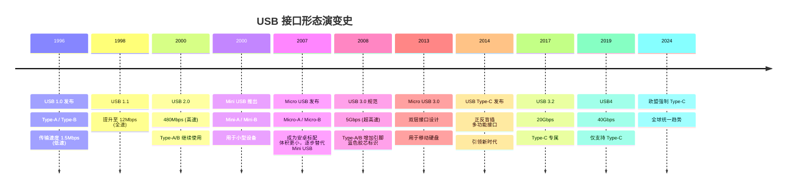
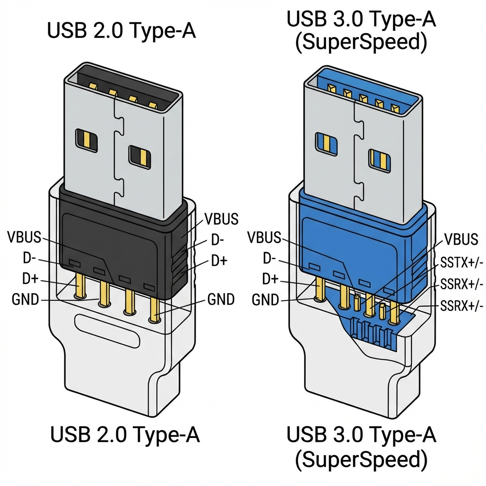
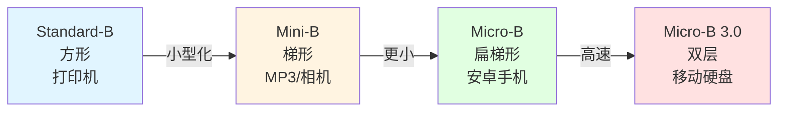
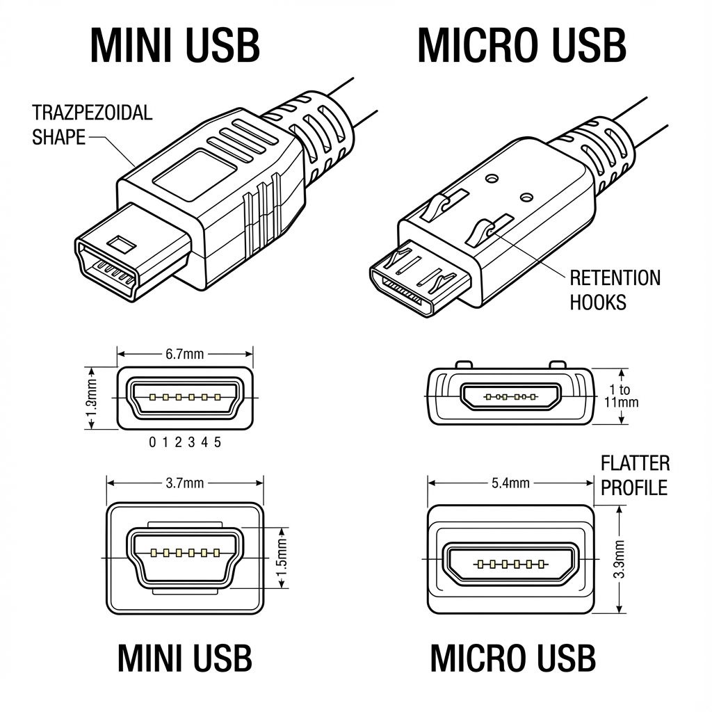
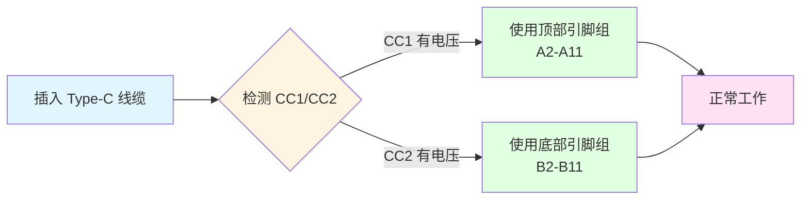
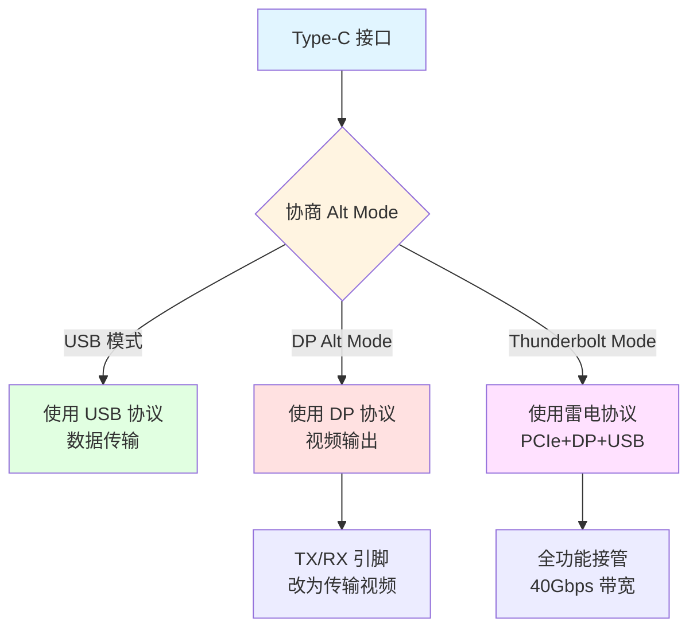

# 第 2 章:USB 接口形态 (USB Connector Types)

USB 接口经历了多次物理形态的演变，以适应更小巧的设备和更高的传输需求。

## USB 接口演进历史

### 为什么需要不同的接口形态？

USB 标准诞生于 1996 年，最初的 Type-A 和 Type-B 接口设计用于台式电脑和外设。随着技术发展，不同的需求催生了多种接口形态：

-   **小型化需求**：移动设备（MP3、手机、相机）需要更小的接口
-   **功能扩展**：从单纯的数据传输扩展到视频、音频、供电
-   **用户体验**：正反盲插、更高的插拔寿命
-   **标准统一**：减少电子垃圾，提升互操作性

> [!IMPORTANT]
> 2024 年起，欧盟强制要求所有消费电子设备必须使用 **USB Type-C** 接口，推动全球接口标准统一。苹果也因此从 iPhone 15 系列开始全面转向 Type-C。

---

### USB 接口形态演进时间线



---

### 各接口的兴衰历程

**Type-A 的持久生命力**：
-   作为 **主机端接口**，Type-A 从 1996 年至今仍广泛使用
-   电脑、充电器、电视、车载系统等设备的标配
-   向下兼容性极好，USB 3.2 仍可使用 Type-A

**Micro USB 的辉煌与落幕**：
-   2007-2020 年间的**移动设备霸主**
-   全球数十亿部安卓手机使用 Micro USB
-   缺陷明显（易损坏、不可盲插、速度慢），最终被 Type-C 取代

**Type-C 的统一之路**：
-   2014 年发布时曾遭抗拒（如苹果坚持 Lightning）
-   2024 年欧盟立法强制推行
-   现已成为**笔记本、手机、平板、充电器的统一标准**

---

## USB Type-A

这是最经典的 USB 接口，广泛应用于电脑主机、充电头和电视等设备。

-   **外观**：矩形接口，只能单面插入（有防呆设计）。
-   **尺寸**：约 12mm × 4.5mm
-   **插拔寿命**：约 1,500 次（标准规定）

### 引脚定义

#### USB 2.0 Type-A（4 针）

| 引脚 | 名称 | 功能 |
|------|------|------|
| 1 | VBUS | 电源正极 (+5V) |
| 2 | D- | 数据负 |
| 3 | D+ | 数据正 |
| 4 | GND | 电源地 |

#### USB 3.0/3.1/3.2 Type-A（9 针）

在 USB 2.0 的 4 针基础上，增加了 5 个引脚用于高速传输：

| 引脚 | 名称 | 功能 |
|------|------|------|
| 5 | StdA_SSRX- | 超高速接收负 |
| 6 | StdA_SSRX+ | 超高速接收正 |
| 7 | GND_DRAIN | 屏蔽地 |
| 8 | StdA_SSTX- | 超高速发送负 |
| 9 | StdA_SSTX+ | 超高速发送正 |

> [!NOTE]
> USB 3.0+ 的额外 5 个引脚位于接口内部深处，与 USB 2.0 的 4 针物理分离，这就是为什么 USB 3.0 设备可以插入 USB 2.0 接口（只使用前4针）。

---

### 颜色编码标准

USB-IF 建议使用不同的颜色标识接口的能力，但**不是强制标准**，厂商可能不遵守：

| 颜色 | 含义 | 说明 |
|------|------|------|
| **黑色/白色** | USB 2.0 | 最高 480Mbps，最常见 |
| **蓝色** | USB 3.0/3.1 Gen 1 | 5Gbps，官方推荐色 |
| **青色（Teal）** | USB 3.1 Gen 2 | 10Gbps（较少见） |
| **红色** | USB 3.2 / 大电流充电 | 20Gbps 或支持快充 |
| **黄色** | 常供电 / 快充 | 关机也供电，或支持 BC 1.2 |

> [!TIP]
> **如何识别**：查看接口内部的塑料胶芯颜色。蓝色胶芯几乎可以确定是 USB 3.0+，但黑色/白色并不一定是 USB 2.0（部分厂商不遵守颜色标准）。

---

### 电源能力

| USB 版本 | 最大电流 | 最大功率 | 说明 |
|---------|---------|---------|------|
| USB 2.0 | 500mA | 2.5W (5V 0.5A) | 标准供电 |
| USB 3.0 | 900mA | 4.5W (5V 0.9A) | 提升供电能力 |
| USB BC 1.2 | 1.5A | 7.5W (5V 1.5A) | 专用充电端口 (DCP) |
| USB 3.1/3.2 | 最高 3A | 15W (5V 3A) | 部分实现 |

> [!WARNING]
> Type-A 接口**功率有限**，无法支持 USB PD 快充。如需高功率充电（>15W），必须使用 **Type-C**。

---

### 应用场景

**主机端（输出）**：
-   💻 台式机和笔记本电脑
-   🖥️ 显示器、电视
-   🔌 充电器、移动电源
-   🚗 车载 USB 接口

**设备端（输入）**：
-   Type-A 一般**不用于设备端**，设备通常使用 Type-B、Micro USB 或 Type-C



## USB Type-B 系列

主要用于连接外部设备，如打印机、扫描仪和早期的外置硬盘盒。Type-B 的设计理念是**区分主机和设备**：Type-A 用于主机端，Type-B 用于设备端。

### Type-B 家族成员

#### Standard-B（方形接口）

-   **外观**：近似正方形，顶部两角有切角
-   **尺寸**：约 8mm × 7mm
-   **引脚**：4 针（USB 2.0）或 9 针（USB 3.0）
-   **应用**：打印机、扫描仪、桌面音频接口

#### Mini USB Type-B

-   **外观**：梯形，比 Standard-B 小很多
-   **尺寸**：约 7mm × 3mm
-   **引脚**：5 针
-   **应用**：早期 MP3、数码相机、GPS 设备
-   **状态**：**已淘汰**，被 Micro USB 取代

#### Micro USB Type-B（最常见）

-   **外观**：扁梯形，带有两个倒钩
-   **尺寸**：约 7mm × 1.8mm
-   **引脚**：5 针（USB 2.0）
-   **应用**：2007-2020 年间的安卓手机、蓝牙耳机、移动电源
-   **状态**：逐渐被 Type-C 取代，但仍有大量存量设备

#### Micro USB 3.0 Type-B（双层接口）

-   **外观**：扁平且宽，**双层设计**（左侧是 Micro USB 2.0，右侧是额外的高速引脚）
-   **尺寸**：约 12mm × 1.8mm
-   **引脚**：10 针（5 针 USB 2.0 + 5 针 USB 3.0）
-   **应用**：移动硬盘（如西部数据 Elements、希捷 Backup Plus）、部分三星手机（Galaxy Note 3/S5）
-   **特点**：**向下兼容** Micro USB 2.0 线材（只插左侧部分）



---

### 为什么 Type-B 不常见于个人设备？

-   **方向性设计**：Type-B 系列体现了 USB 的"主从"设计理念，设备端用 Type-B，主机端用 Type-A
-   **体积问题**：Standard-B 较大，不适合小型设备
-   **Type-C 取代**：现代设备直接使用 Type-C，不再区分主从


## Mini USB & Micro USB

为移动设备设计的接口标准。

### Mini USB（已淘汰）

-   **发布时间**：2000 年
-   **外观**：梯形，比 Standard-B 小，但仍然较笨重
-   **引脚**：5 针
-   **类型**：
    -   **Mini-A**：主机端（极少见）
    -   **Mini-B**：设备端（最常见）
    -   **Mini-AB**：可作主机或设备（OTG 专用）
-   **应用**：早期 MP3 播放器、数码相机、GPS 导航仪、功能机
-   **状态**：**2007 年被 Micro USB 取代，现已完全淘汰**

---

### Micro USB（逐渐淘汰）

#### Micro USB 2.0 Type-B

**引脚定义**（5 针）：

| 引脚 | 名称 | 功能 |
|------|------|------|
| 1 | VBUS | 电源正极 (+5V) |
| 2 | D- | 数据负 |
| 3 | D+ | 数据正 |
| 4 | ID | 识别引脚（OTG 用） |
| 5 | GND | 电源地 |

**特点**：
-   **ID 引脚的作用**：用于 **OTG (On-The-Go)** 功能，识别设备角色
    -   ID 引脚接地：设备作为主机（可连接 U 盘、键盘等）
    -   ID 引脚悬空：设备作为从机（正常充电和数据传输）
-   **体积**：仅 7mm × 1.8mm，是 Mini USB 的一半
-   **插拔寿命**：约 10,000 次（标准规定）

#### OTG (On-The-Go) 功能

OTG 允许移动设备在**没有电脑**的情况下直接连接外设：

**应用场景**：
-   📱 手机连接 U 盘读取文件
-   🎮 手机连接游戏手柄
-   ⌨️ 平板连接键盘/鼠标
-   📷 相机直连打印机

**工作原理**：
-   使用 **Micro USB OTG 线材**（一端 Micro USB，一端 Type-A 母口）
-   ID 引脚自动识别设备角色
-   手机需要支持 OTG 功能（大部分安卓设备支持）

---

### Micro USB 的缺陷

尽管 Micro USB 曾是移动设备的标配，但存在诸多问题：

**1. 容易插反导致损坏**
-   ❌ 接口有方向性，必须**正面朝上**插入
-   ❌ 暴力插反会损坏接口内部的倒钩或设备端的舌片
-   ❌ 长期使用容易松动

**2. 插拔寿命短**
-   虽然标准规定 10,000 次，但实际使用中**接触不良**问题频发
-   倒钩设计容易变形

**3. 速度限制**
-   绝大部分 Micro USB 只支持 **USB 2.0**（480Mbps）
-   传输大文件（如 4K 视频）非常慢
-   Micro USB 3.0 虽然支持 5Gbps，但因双层设计过于笨重，未能普及

**4. 供电能力有限**
-   最高仅 7.5W (5V 1.5A, BC 1.2)
-   无法满足现代手机的快充需求（动辄 30W+）

**5. 功能单一**
-   只能传输数据和供电
-   无法输出视频（无 Alt Mode）

> [!WARNING]
> 如果您的 Micro USB 接口出现以下问题，说明已损坏：
> - 松动，线材插入后容易掉落
> - 充电断断续续
> - 数据传输无法识别
> 
> **建议及时更换设备或接口**，使用受损接口可能引发短路风险。



## USB Type-C

未来的通用标准，旨在统一数据、视频和电力传输。

-   **外观**：扁平椭圆形，**支持正反盲插**
-   **尺寸**：8.4mm × 2.6mm
-   **插拔寿命**：约 10,000 次（与 Micro USB 相同，但更坚固耐用）
-   **发布时间**：2014 年

> [!IMPORTANT]
> **Type-C 只是接口形态，不代表协议**。一个 Type-C 接口可能只支持 USB 2.0 速度（如部分入门手机），也可能支持雷电 4 (40Gbps)。购买设备和线材时务必确认具体规格。

---

### Type-C 的核心优势

1. ✅ **正反盲插**：任意方向都能插入，无需区分正反
2. ✅ **多功能整合**：数据 + 视频 + 音频 + 供电，一个接口全搞定
3. ✅ **高功率供电**：最高支持 240W (USB PD 3.1)
4. ✅ **高速传输**：最高 40Gbps (USB4 / Thunderbolt 4)
5. ✅ **更坚固**：改进的机械设计，不易损坏
6. ✅ **全球统一**：欧盟强制推行，成为事实标准

---

### Type-C 24 引脚详解

Type-C 接口拥有 **24 个引脚**，布局完全对称以实现正反插。

#### 引脚布局图（俯视图）

```
顶部（12引脚）
A1 GND  | A2 TX1+ | A3 TX1- | A4 VBUS | A5 CC1  | A6 D+  | A7 D-  | A8 SBU1 | A9 VBUS | A10 RX2- | A11 RX2+ | A12 GND
━━━━━━━━━━━━━━━━━━━━━━━━━━━━━━━━━━━━━━━━━━━━━━━━━━━━━━━━━━━━━━━━━━━━━━━━━━━━━━━━━━━━━━━━━━━━━━━━
底部（12引脚，镜像对称）
B12 GND | B11 RX1+ | B10 RX1- | B9 VBUS | B8 SBU2 | B7 D-  | B6 D+  | B5 CC2  | B4 VBUS | B3 TX2- | B2 TX2+ | B1 GND
```

#### 引脚分类和功能

| 引脚类型 | 数量 | 名称 | 功能 |
|---------|------|------|------|
| **电源** | 8 | VBUS (A4, A9, B4, B9)<br/>GND (A1, A12, B1, B12) | 供电和地线，最高支持 240W |
| **USB 2.0 数据** | 4 | D+ (A6, B6)<br/>D- (A7, B7) | USB 2.0 差分数据对（480Mbps），双份冗余 |
| **USB 3.x/4 高速数据** | 8 | TX1+/- (A2, A3)<br/>RX1+/- (B10, B11)<br/>TX2+/- (B2, B3)<br/>RX2+/- (A10, A11) | 超高速差分对，两组 TX/RX（5-40Gbps） |
| **配置通道** | 2 | CC1 (A5)<br/>CC2 (B5) | 检测方向、协商角色、PD 通信 |
| **边带信号** | 2 | SBU1 (A8)<br/>SBU2 (B8) | Alt Mode 使用（如音频、低速信号） |

> [!NOTE]
> Type-C 的引脚是**完全对称**的，这就是为什么可以正反插。插入时，使用上半部分或下半部分的引脚，功能完全相同。

---

### 正反插的秘密：CC 引脚

#### CC 引脚的多重作用

**CC (Configuration Channel)** 引脚是 Type-C 的核心创新，负责：

1. **方向检测**
   - 插入线缆后，设备检测 CC1 和 CC2 哪个有信号
   - 有信号的一侧确定为"活动侧"，使用对应的数据引脚

2. **设备角色协商 (DRP: Dual-Role Power)**
   - 确定谁是 **Source（供电方）**，谁是 **Sink（受电方）**
   - Type-C 设备可以动态切换角色（如手机既能充电，也能给耳机供电）

3. **电流能力通告**
   - Source 通过 CC 引脚上的电阻告知可提供的电流
   - **Default (500mA/900mA)**、**1.5A**、**3A**

4. **USB PD 通信**
   - 进行复杂的功率协商
   - 传输 PD 消息（Source_Capabilities、Request 等）

#### 正反插工作流程



---

### Alt Mode：Type-C 的超能力

**Alternate Mode (替代模式)** 允许 Type-C 接口传输 **非 USB 协议**的信号，如视频、音频等。

#### 支持的 Alt Mode

**1. DisplayPort Alt Mode**
-   **功能**：通过 Type-C 输出视频信号
-   **应用**：
    -   笔记本电脑连接外置显示器
    -   手机/平板投屏到电视
    -   Type-C 转 HDMI/DP 转接器
-   **最高分辨率**：8K@60Hz（DP 2.0）
-   **占用引脚**：使用 USB 3.x 的 TX/RX 引脚传输视频

**2. Thunderbolt 3/4 Alt Mode**
-   **功能**：雷电协议，集成 PCIe、DisplayPort、USB
-   **速度**：40Gbps
-   **应用**：
    -   高速外置显卡 (eGPU)
    -   专业级 SSD
    -   雷电扩展坞
-   **兼容性**：Thunderbolt 3/4 必须使用 Type-C 接口

**3. HDMI Alt Mode**
-   **功能**：直接传输 HDMI 信号
-   **应用**：Type-C 转 HDMI 线材（无需转换芯片，成本更低）

**4. Audio Adapter Accessory Mode**
-   **功能**：模拟音频输出
-   **应用**：Type-C 转 3.5mm 耳机转接器
-   **引脚**：使用 SBU1/SBU2 传输音频信号

#### Alt Mode 工作原理



> [!TIP]
> 不是所有 Type-C 接口都支持 Alt Mode。查看设备规格时，注意标注"支持视频输出"或"DP Alt Mode"字样。

---

### 全功能 Type-C vs 阉割版 Type-C

由于成本考虑，许多设备的 Type-C 接口功能并不完整，存在"阉割"现象。

#### 功能矩阵对比

| 功能 | 仅 USB 2.0 | USB 3.x无视频 | 全功能 Type-C | Thunderbolt 4 |
|------|-----------|--------------|--------------|--------------|
| **数据传输** | 480Mbps | 5-20Gbps | 5-40Gbps | 40Gbps |
| **充电功率** | 最高 15W | 最高 100W | 最高 240W (PD 3.1) | 最高 100W |
| **视频输出** | ❌ | ❌ | ✅ (DP Alt Mode) | ✅ (DP 2.0) |
| **雷电协议** | ❌ | ❌ | ❌ | ✅ |
| **成本** | 💰 最低 | 💰💰 中等 | 💰💰💰 较高 | 💰💰💰💰 最高 |
| **常见设备** | 入门手机 | 中端手机/PC | 旗舰手机/笔记本 | 高端笔记本/Mac |

#### 为什么会有"阉割版"？

**成本控制示例**：
-   **仅 USB 2.0 的 Type-C**（如 iPhone 15 基础版）：
    -   省去 USB 3.x 的 PHY 芯片和高速走线
    -   成本降低约 $1-2
    -   但传输速度仅 480Mbps
-   **无视频输出的 Type-C**：
    -   省去 DP Mux（视频信号复用器）
    -   降低主控芯片复杂度

> [!WARNING]
> 购买设备时务必确认 Type-C 接口的具体规格：
> - 📱 **手机**：查看是否支持视频输出（如三星 DeX、华为云电脑）
> - 💻 **笔记本**：确认哪些 Type-C 口支持充电、哪些支持视频
> - 🔌 **充电器**：确认是否支持 USB PD 和最高功率

---

### Type-C 与 Thunderbolt 的关系

**Thunderbolt 3/4 必须使用 Type-C 接口，但 Type-C ≠ Thunderbolt**

#### 区别和关系

<table>
<tr>
<td><strong>项目</strong></td>
<td><strong>USB Type-C</strong></td>
<td><strong>Thunderbolt 3/4</strong></td>
</tr>
<tr>
<td>性质</td>
<td>接口形态标准</td>
<td>传输协议标准</td>
</tr>
<tr>
<td>速度</td>
<td>USB2.0~USB4 (480Mbps-40Gbps)</td>
<td>固定 40Gbps</td>
</tr>
<tr>
<td>功能</td>
<td>数据+充电，可选视频</td>
<td>数据+充电+视频+PCIe</td>
</tr>
<tr>
<td>认证</td>
<td>USB-IF 认证</td>
<td>Intel 认证（现已开放）</td>
</tr>
<tr>
<td>标识</td>
<td>USB 标志</td>
<td>⚡闪电标志</td>
</tr>
<tr>
<td>成本</td>
<td>低</td>
<td>高（需要雷电控制器）</td>
</tr>
</table>

#### 如何识别 Thunderbolt 接口

**标识符**：
-   ⚡ **闪电标志**：接口旁边有雷电图标
-   🔢 **数字标注**：Thunderbolt 3/4 会标注"3"或"4"
-   💻 **设备标识**：在系统信息中查看（如 MacBook 的 Thunderbolt 接口明确标注）

**功能测试**：
-   能否连接雷电设备（如 eGPU）
-   传输速度是否达到 40Gbps
-   是否支持菊花链（Daisy Chain，串联多个设备）


---

## USB 接口全面对比

### 接口形态对比总表

| 接口类型 | 尺寸 (mm) | 引脚数 | 插拔方式 | 最高速度 | 最高功率 | 插拔寿命 | 应用场景 | 当前状态 |
|---------|----------|--------|---------|---------|---------|---------|---------|---------|
| **Type-A** | 12×4.5 | 4/9 | 单向 | 20Gbps (USB 3.2) | 15W | 1,500次 | 主机端（PC、充电器） | ✅ 广泛使用 |
| **Standard-B** | 8×7 | 4/9 | 单向 | 20Gbps | 依赖主机 | 1,500次 | 打印机、扫描仪 | ⚠️ 逐渐淘汰 |
| **Mini USB** | 7×3 | 5 | 单向 | 480Mbps | 2.5W | 5,000次 | 早期 MP3/相机 | ❌ 已淘汰 |
| **Micro USB** | 7×1.8 | 5 | 单向 | 480Mbps | 7.5W | 10,000次 | 安卓旧机型 | ⚠️ 逐渐淘汰 |
| **Micro USB 3.0** | 12×1.8 | 10 | 单向 | 5Gbps | 7.5W | 10,000次 | 移动硬盘 | ⚠️ 逐渐淘汰 |
| **Type-C** | 8.4×2.6 | 24 | **正反盲插** | 40Gbps (USB4) | 240W (PD 3.1) | 10,000次 | 全平台通用 | ✅ 主流趋势 |

> [!TIP]
> 表格中的"最高速度"和"最高功率"是理论上限，实际设备可能因成本限制而达不到。购买前务必查看具体规格。

---

## 实战指南

### 如何识别 USB 接口和线材规格

#### 识별接口类型

**1. 通过外观**
-   **Type-A**：矩形，只能单方向插入
-   **Type-C**：椭圆形，正反都能插
-   **Micro USB**：扁梯形，有两个倒钩

**2. 通过颜色（仅 Type-A）**
-   🔵 蓝色：USB 3.0/3.1 Gen 1 (5Gbps)
-   ⚫ 黑色/白色：通常是 USB 2.0 (480Mbps)
-   🔴 红色：USB 3.2 或支持快充
-   🟡 黄色：常供电或快充端口

**3. 通过标识**
-   **SS (SuperSpeed)**：USB 3.0 (5Gbps)
-   **SS 10** 或 **SS+**：USB 3.1 Gen 2 (10Gbps)
-   **SS 20**：USB 3.2 (20Gbps)
-   **⚡ 雷电标志**：Thunderbolt 3/4 (40Gbps)
-   **USB-IF 认证标志**：通过官方认证的产品

#### 识别线材规格

**Type-C 线材的陷阱**：
-   ❌ **充电线**：只有电源引脚，无数据功能（仅能充电）
-   ⚠️ **USB 2.0 线**：只有 USB 2.0 数据引脚，速度 480Mbps
-   ✅ **USB 3.x 全功能线**：支持高速数据
-   ✅ **E-Marker 线**：支持 100W 充电（5A）
-   ✅ **Thunderbolt 线**：支持 40Gbps + 100W

**检查方法**：
1. 查看线材上的标识（SS、5A、Thunderbolt 等）
2. 使用 USB 测试仪（如 POWER-Z）检测
3. 查看产品规格说明

---

### 常见问题 FAQ

**Q1: 为什么我的 Type-C 线能充电但不能传输数据？**
-   **A**: 这是一根**充电线**（Charge-Only Cable），内部只有电源线，没有数据线。购买时需明确标注"支持数据传输"。

**Q2: Type-C 转 Type-A 的线有什么限制？**
-   **A**: 
    -   速度限制在 Type-A 的最高速率（USB 3.2: 20Gbps）
    -   功率限制在 Type-A 的能力（最高 15W），无法使用 USB PD 快充
    -   无法使用 Type-C 的 Alt Mode（视频输出）

**Q3: 如何识别全功能 Type-C 接口？**
-   **A**: 查看设备规格说明中是否标注：
    -   "支持视频输出" 或 "DP Alt Mode"
    -   "支持 USB PD" 和最高功率
    -   "USB 3.x/4" 速度规格
    -   若无明确说明，可能是阉割版

**Q4: Micro USB OTG 线为什么可以连接 U 盘？**
-   **A**: OTG 线内部的 **ID 引脚接地**，告诉手机"你现在是主机"，手机就能为 U 盘供电并读取数据。普通 Micro USB 线的 ID 引脚是悬空的。

**Q5: Type-C 线材为什么价格差距这么大？**
-   **A**: 
    -   💰 便宜线（￥10以下）：只支持充电或 USB 2.0
    -   💰💰 中档线（￥20-50）：USB 3.x 数据+快充
    -   💰💰💰 高端线（￥100+）：全功能+E-Marker+USB-IF 认证
    -   💰💰💰💰 雷电线（￥200+）：Thunderbolt 40Gbps

**Q6: 手机有 Type-C 接口就能用 PD 快充吗？**
-   **A**: **不一定**。需要：
    1. 手机支持 USB PD 协议（查看规格说明）
    2. 充电器支持 USB PD 并提供合适的功率档位
    3. 线材支持相应的电流（如 3A、5A E-Marker 线）
    4. 三者缺一不可

---

## 兼容性和安全

### 向下兼容性

**USB 接口的向下兼容原则**：
-   ✅ USB 3.0 设备可插入 USB 2.0 接口（降速至 480Mbps）
-   ✅ USB 3.0 端口可使用 USB 2.0 设备
-   ✅ Type-C 设备可通过转接线使用 Type-A 端口
-   ❌ 但功率和速度会受限于较低的标准

---

### 转接线材的限制

| 转接类型 | 速度限制 | 功率限制 | 视频输出 | 注意事项 |
|---------|---------|---------|---------|---------|
| **Type-C to Type-A** | Type-A 最高速率 | 最高 15W | ❌ 不支持 | 常见转接方式 |
| **Type-C to HDMI/DP** | N/A | 设备端供电 | ✅ 支持 | 需设备支持 DP Alt Mode |
| **Micro USB to Type-C** | USB 2.0 (480Mbps) | 最高 7.5W | ❌ 不支持 | 仅应急使用，不推荐 |
| **Thunderbolt to Type-C** | 40Gbps | 100W | ✅ 支持 | 价格昂贵，需认证线材 |

> [!WARNING]
> **不要使用劣质转接头**：
> - 可能损坏设备接口
> - 充电时过热甚至起火
> - 数据传输不稳定或丢失

---

### 安全注意事项

**1. 暴力插拔的风险**
-   ❌ Micro USB 最容易损坏：倒钩变形、舌片断裂
-   ⚠️ Type-A 也会磨损：频繁插拔导致弹片失效
-   ✅ Type-C 相对坚固：但仍需轻柔操作

**2. 接口进水处理**
-   �� **不要立即充电**：可能短路烧毁设备
-   💨 **自然风干**：放置通风处24小时
-   🌾 **可用干燥剂**：放入密封袋加干燥剂加速
-   ⚠️ **不要用吹风机**：高温可能损坏内部元件

**3. 接口松动问题**
-   **Micro USB 松动**：送修更换接口或使用无线充电
-   **Type-C 松动**：检查接口内是否有灰尘，用牙签轻轻清理（断电）
-   **Type-A 松动**：弹片疲劳，更换接口或设备

**4. 充电安全**
-   使用原装或认证充电器和线材
-   避免边充电边玩游戏（散热不良）
-   充电时手机过热（>45°C）立即停止

---

## 选购建议

### 线材选购指南

#### Type-C 线材选择

**用途 1：日常充电**
-   功率需求：根据设备快充功率选择
    -   30W以下：普通 3A 线材（￥20左右）
    -   67W-100W：E-Marker 5A 线材（￥40-80）
    -   100W以上：EPR 认证线材（￥100+）
-   品牌推荐：Anker、Baseus、UGREEN、Apple 原装

**用途 2：数据传输**
-   速度需求：
    -   日常文件：USB 2.0 线即可（￥10-20）
    -   大文件/视频剪辑：USB 3.2 线（￥30-60）
    -   专业工作：Thunderbolt 4 线（￥200+）
-   长度选择：
    -   1米以内：全速传输
    -   1-2米：可能略有损耗
    -   3米以上：速度明显下降，需主动线材（内置芯片）

**用途 3：视频输出**
-   Type-C to HDMI/DP：确认支持 4K@60Hz 或更高
-   长度：建议 2米以内保证信号质量
-   品牌推荐：Belkin、Cable Matters、Club 3D

**认证标识**：
-   ✅ **USB-IF 认证**：可在 [usb.org](https://www.usb.org/products) 查询
-   ✅ **Thunderbolt 认证**：带闪电标志
-   ⚠️ 无认证的线材需谨慎购买

---

### 设备接口配置建议

#### 笔记本电脑最佳配置

**低配版**（办公用）：
-   2× Type-A (USB 3.0)
-   1× Type-C (USB 3.1 + PD 充电)
-   1× HDMI

**标准版**（多数用户）：
-   2× Type-A (1个 USB 3.2)
-   2× Type-C (1个支持 PD 充电 + DP Alt Mode)
-   1× HDMI / DP

**专业版**（内容创作/开发）：
-   1× Type-A (USB 3.2)
-   3× Type-C (其中 2个 Thunderbolt 4)
-   支持双 4K 显示器输出
-   100W PD 充电

#### 充电器选择

**场景 1：单设备用户（手机/平板）**
-   单口 GaN 充电器：30-67W
-   支持 PD + PPS
-   品牌：Anker、Baseus、紫米

**场景 2：多设备用户**
-   多口 GaN 充电器：100-150W
-   2C1A 或 3C 配置
-   智能功率分配
-   推荐：Anker 747 (150W)、Baseus 160W

**场景 3：笔记本+手机**
-   单口 100W+ 或双口智能分配
-   确保至少一个口能输出 65W 以上
-   出差首选：体积小的 GaN 充电器

---

## 术语表

| 术语 | 英文全称 | 解释 |
|------|---------|------|
| **正反盲插** | Reversible Plug | Type-C 特性，任意方向插入无需区分正反 |
| **Alt Mode** | Alternate Mode | Type-C 替代模式，用于传输非 USB 信号（视频/音频） |
| **OTG** | On-The-Go | 允许移动设备作为主机连接外设（U 盘、键鼠等） |
| **CC 引脚** | Configuration Channel | Type-C 配置通道，负责方向检测、角色协商、PD 通信 |
| **SBU 引脚** | Sideband Use | Type-C 边带信号，用于 Alt Mode 音频等 |
| **DRP** | Dual-Role Power | 双角色电源，Type-C 设备可作主机或从机 |
| **E-Marker** | Electronically Marked Cable | 电子标记线材，内置芯片告知设备线材能力 |
| **GaN** | Gallium Nitride | 氮化镓，新一代半导体材料，用于高效充电器 |
| **eGPU** | External Graphics Processing Unit | 外置显卡，通过 Thunderbolt 连接笔记本 |
| **Daisy Chain** | 菊花链 | 串联连接多个 Thunderbolt 设备（最多6个） |
| **PHY 芯片** | Physical Layer Chip | 物理层芯片，负责信号收发 |
| **DP Mux** | DisplayPort Multiplexer | 视频信号复用器，用于 Alt Mode |

---

## 延伸阅读

### 官方规范
-   [USB-IF 官方网站](https://www.usb.org/)
-   [USB Type-C 规范文档](https://www.usb.org/document-library/usb-type-cr-cable-and-connector-specification)
-   [Thunderbolt 技术网站](https://www.thunderbolttechnology.net/)

### 认证查询
-   [USB-IF 认证产品查询](https://www.usb.org/products)
-   查询线材和设备是否通过官方认证

### 推荐工具
-   **POWER-Z 系列**：USB 协议测试仪，显示充电功率和协议
-   **ChargerLAB KT002**：专业级测试仪
-   **USB Device Tree Viewer**：查看 USB 设备树（Windows）
-   **System Information**：Mac 系统信息（查看 USB/Thunderbolt 设备）

---

> [!NOTE]
> USB 接口标准仍在持续演进。USB4 Version 2.0 (80Gbps) 和更高功率的 PD 规范正在开发中。建议关注 USB-IF 官方更新，了解最新技术动态。
