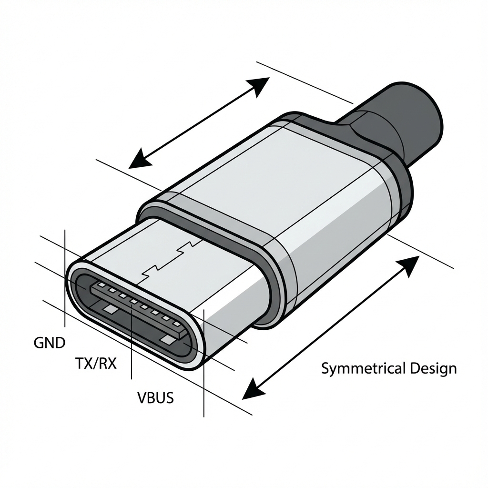

# 第 2 章：USB 接口形态 (USB Connector Types)

USB 接口经历了多次物理形态的演变，以适应更小巧的设备和更高的传输需求。

## USB Type-A

这是最经典的 USB 接口，广泛应用于电脑主机、充电头和电视等设备。

-   **外观**：矩形接口，只能单面插入。
-   **版本区分**：
    -   **USB 2.0**：通常内部胶芯为**黑色**或**白色**，只有 4 个触点。
    -   **USB 3.0+**：通常内部胶芯为**蓝色**，增加了 5 个隐蔽触点以支持高速传输（共 9 个触点）。部分厂商也会使用红色或黄色表示支持大电流充电。

## USB Type-B

主要用于连接外部设备，如打印机、扫描仪和早期的外置硬盘盒。

-   **Standard-B**：方形接口，常见于打印机。
-   **Micro-B (USB 3.0)**：一种扁平且宽的接口，常见于早期的移动硬盘（如西部数据 Elements 系列），因为支持 USB 3.0 的高速传输。

## Mini USB & Micro USB

为移动设备设计的接口标准。

-   **Mini USB**：早期 MP3、功能机常用，呈梯形，现已基本淘汰。
-   **Micro USB**：安卓手机普及时代的霸主。呈扁梯形，带有两个倒钩。缺点是容易插反导致接口损坏，且仅支持 USB 2.0 速率（大多数情况下）。

## USB Type-C

未来的通用标准，旨在统一数据、视频和电力传输。

-   **外观**：扁平椭圆形，**支持正反盲插**。
-   **特性**：
    -   **多功能**：不仅传输数据，还能传输视频（DP Alt Mode）和高达 240W 的电力（USB PD）。
    -   **引脚丰富**：拥有 24 个引脚（实际使用 22 个），包含用于协商协议的 CC (Configuration Channel) 引脚。
-   **注意**：**Type-C 只是接口形态，不代表协议**。一个 Type-C 接口可能只支持 USB 2.0 速度（如部分入门手机），也可能支持雷电 4。

