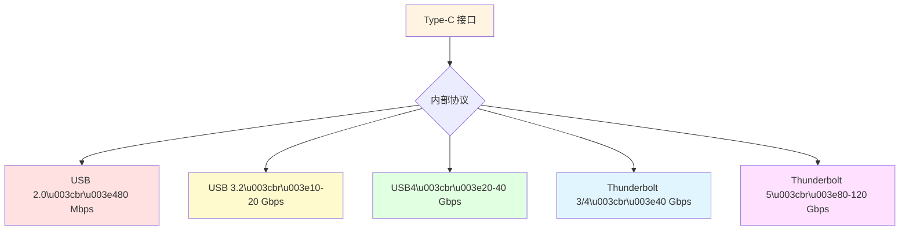
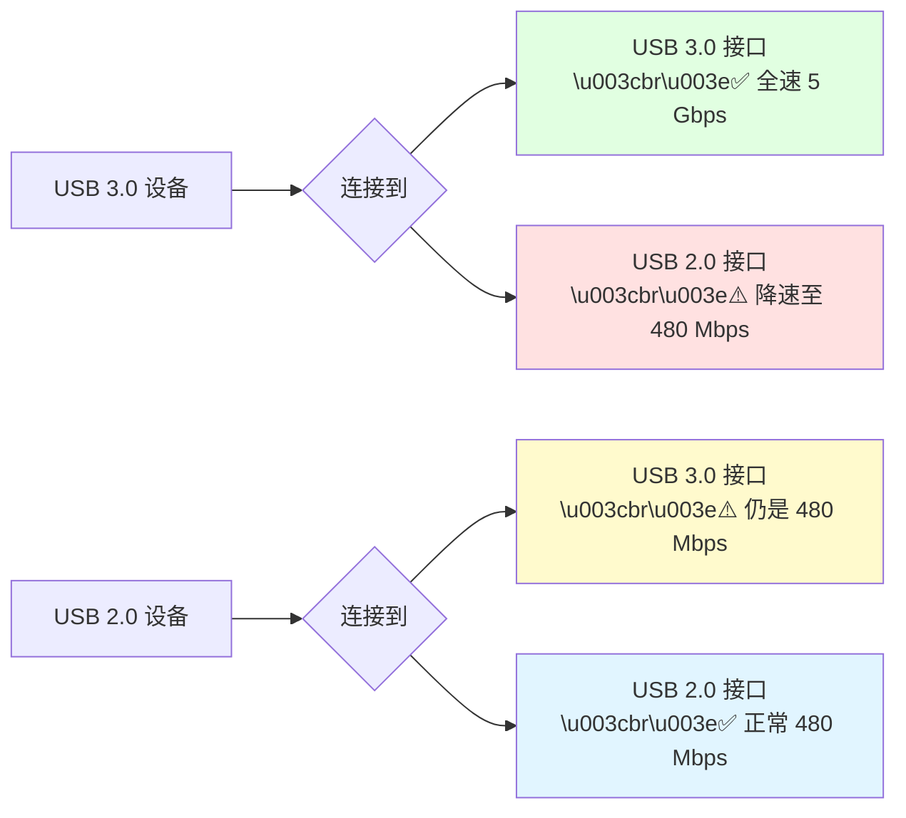
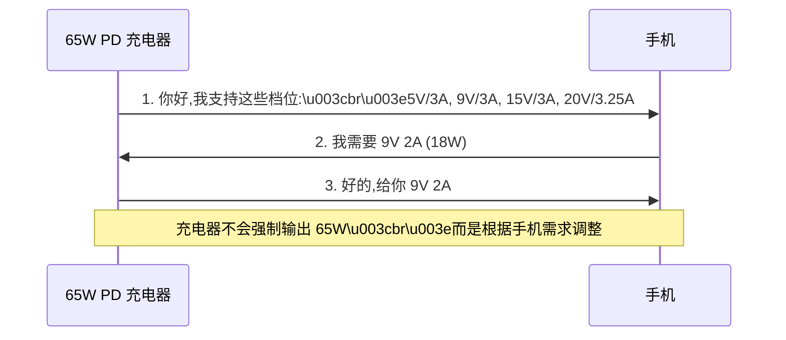
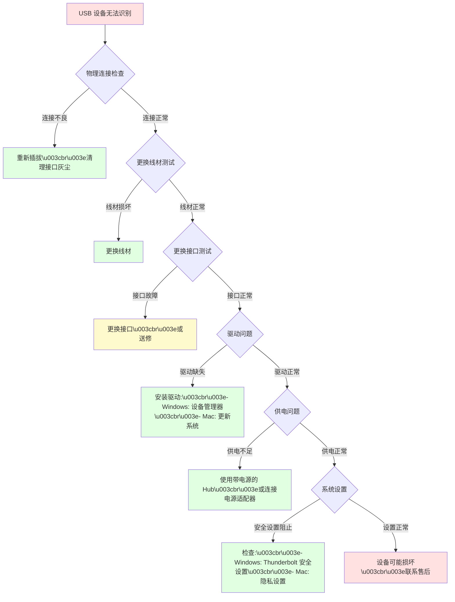

# 第 6 章：常见问题与误区 (FAQ & Common Misconceptions)

本章整合了前面各章节的常见问题,并新增了常见误区解析、故障排查指南和快速参考表,帮助您快速找到答案,避免购买和使用中的常见陷阱。

---

## 📑 快速导航

- [接口与连接问题](#接口与连接问题)
- [速度与性能问题](#速度与性能问题)
- [充电与供电问题](#充电与供电问题)
- [Thunderbolt 相关问题](#thunderbolt-相关问题)
- [购买与选择问题](#购买与选择问题)
- [常见误区解析](#常见误区解析)
- [故障排查指南](#故障排查指南)
- [快速参考表](#快速参考表)

---

## 接口与连接问题

### Q1: 所有的 Type-C 线都是一样的吗?

**A**: **绝对不是!** 这是最大的误区之一。

Type-C 只是**接口形态**(物理形状),内部可能有天壤之别:

| 线材类型 | 数据速度 | 充电功率 | 视频输出 | 价格 | 典型应用 |
|---------|---------|---------|---------|------|---------|
| **仅充电线** | ❌ 无数据 | 5-15W | ❌ | ¥10-20 | 便宜充电线 |
| **USB 2.0 线** | 480 Mbps | 15W | ❌ | ¥20-40 | 低端手机数据线 |
| **USB 3.2 Gen 1** | 5 Gbps | 60W | ❌ | ¥40-80 | 普通数据传输 |
| **USB 3.2 Gen 2** | 10 Gbps | 100W | ⚠️ 部分支持 | ¥80-150 | 高速数据+快充 |
| **全功能 USB-C** | 10-20 Gbps | 100W | ✅ 4K | ¥100-200 | 扩展坞、显示器 |
| **Thunderbolt 4** | 40 Gbps | 100W | ✅ 8K | ¥200-500 | 专业设备 |

**识别方法**:
1. 查看线材上的标识(SS、5A、⚡等)
2. 查看包装说明
3. 使用 USB 测试仪检测
4. 连接电脑,查看识别速度

> [!WARNING]
> **外观无法区分**!¥10 的充电线和 ¥500 的雷电线外观可能完全相同。购买时务必查看规格说明,不要被"Type-C"三个字误导。

---

### Q2: Type-C 接口和 USB-C 接口是一回事吗?

**A**: **是的**,这是两种叫法:
-   **Type-C**: USB-IF 官方名称
-   **USB-C**: 市场通俗叫法

两者指的都是同一种物理接口:椭圆形、24针、正反盲插的 USB 接口。

**但要注意**: Type-C/USB-C ≠ 速度快 ≠ 功能全面

-   Type-C 只是接口形状
-   实际速度和功能取决于内部支持的协议(USB 2.0、USB 3.x、USB4、Thunderbolt)

---

### Q3: Thunderbolt 和 USB-C 是一回事吗?

**A**: **不是**。这是另一个常见误区。

-   **USB-C/Type-C**: **接口形态**(物理形状)
-   **Thunderbolt**: **传输协议**(技术标准)

**关系说明**:
-   Thunderbolt 3/4/5 都使用 Type-C 接口
-   但并非所有 Type-C 接口都是 Thunderbolt
-   Thunderbolt 接口旁边有 ⚡ 闪电标志
-   普通 USB-C 没有闪电标志



**识别方法**: 查看 ⚡ 标志或产品规格说明

---

### Q4: 为什么我的 Type-C 设备插入后没反应?

**可能原因**:

**1. 接口类型不匹配**
-   设备需要 Thunderbolt,但电脑只有 USB-C
-   解决: 确认接口协议是否兼容

**2. 线材问题**
-   使用了仅充电线(无数据功能)
-   线材损坏或质量差
-   解决: 更换认证线材

**3. 驱动问题**
-   **Windows**: 缺少 USB/Thunderbolt 驱动
-   **Mac**: 系统版本过旧
-   解决: 更新驱动和系统

**4. 供电不足**
-   高功耗设备(如 eGPU)需要外接供电
-   解决: 连接电源适配器

**5. 安全设置**
-   Thunderbolt 设备被系统阻止
-   解决: 进入安全设置,允许 Thunderbolt 附件

**排查流程**: 见[故障排查指南](#故障排查指南)

---

### Q5: USB Type-A 接口会被淘汰吗?

**A**: **短期内不会完全淘汰,但正在逐渐减少。**

**Type-A 的现状**:
-   ✅ **优势**: 兼容性极好,存量设备海量
-   ✅ **应用**: 鼠标、键盘、U 盘、充电器仍大量使用
-   ⚠️ **劣势**: 无法支持高功率(>15W)、高速(>20Gbps)、视频输出

**未来趋势**:
-   **笔记本**: 逐渐全面转向 Type-C(高端笔记本已只有 Type-C)
-   **台式机**: 仍会保留 Type-A(方便连接旧设备)
-   **外设**: 逐渐转向 Type-C,但过程缓慢
-   **预计**: Type-A 会长期存在,但逐渐边缘化

> [!NOTE]
> 欧盟 2024 年强制 Type-C 政策仅针对消费电子设备(手机、平板、耳机等),不包括电脑主机和外设。

---

### Q6: Mini USB 和 Micro USB 有什么区别?哪个更好?

**A**: **都已过时,均被 Type-C 取代。**

| 对比项 | Mini USB | Micro USB | 当前状态 |
|-------|---------|----------|---------|
| **发布年份** | 2000 | 2007 | - |
| **尺寸** | 较大(7×3mm) | 更小(7×1.8mm) | - |
| **插拔寿命** | 5,000次 | 10,000次 | - |
| **速度** | 480 Mbps (USB 2.0) | 480 Mbps (USB 2.0) | - |
| **应用** | MP3、相机 | 安卓旧手机 | - |
| **现状** | **已淘汰** | **逐渐淘汰** | 被 Type-C 取代 |

**结论**: 都不要买!新设备统一选择 **Type-C**。

---

## 速度与性能问题

### Q7: 为什么我的 USB 3.0 U 盘传输速度很慢?

**可能原因及解决方案**:

**1. 使用了 USB 2.0 线材或接口**

| 症状 | 原因 | 解决方法 |
|------|------|---------|
| 速度仅 30-40 MB/s | 插入黑色(USB 2.0)接口 | 插入蓝色(USB 3.0)接口 |
| 速度仅 30-40 MB/s | 使用 USB 2.0 线材 | 更换 USB 3.0 线材 |

**2. U 盘本身性能差**
-   症状: 即使在 USB 3.0 接口,速度仍只有 50-100 MB/s
-   原因: 廉价 U 盘主控芯片和闪存颗粒质量差
-   解决: 更换品牌 U 盘(闪迪、三星、金士顿等)

**3. 传输大量小文件**
-   症状: 大文件快,小文件极慢
-   原因: 文件系统开销大
-   解决: 先打包成压缩包(ZIP/RAR),再传输

**4. 驱动问题**
-   症状: 设备管理器显示"此设备未正常工作"
-   原因: USB 3.0 驱动缺失或损坏
-   解决: 更新主板芯片组驱动

**5. USB 线材过长**
-   症状: 使用 3m+ 长线材,速度明显下降
-   原因: 信号衰减
-   解决: 使用 ≤1.5m 线材,或主动线材(内置芯片)

---

### Q8: USB 3.2 Gen 2x2 一定要 Type-C 接口吗?

**A**: **是的,必须使用 Type-C。**

**技术原因**:
-   USB 3.2 Gen 2x2 需要**双通道传输**(2 组 TX/RX 差分对)
-   Type-A 接口只有 **1 组** TX/RX,物理上无法实现双通道
-   只有 Type-C 的 24 针才能支持 2 组高速通道

**版本与接口对应**:

| USB 版本 | 最高速度 | Type-A | Type-C |
|---------|---------|--------|--------|
| USB 3.0 (Gen 1) | 5 Gbps | ✅ 支持 | ✅ 支持 |
| USB 3.1 Gen 2 | 10 Gbps | ✅ 支持 | ✅ 支持 |
| **USB 3.2 Gen 2x2** | 20 Gbps | ❌ **不支持** | ✅ **仅支持** |
| USB4 | 40 Gbps | ❌ 不支持 | ✅ 仅支持 |

---

### Q9: USB4 和 Thunderbolt 4 有什么区别?

**A**: **Thunderbolt 4 是 USB4 的"满血版"。**

**核心区别**:

| 对比项 | USB4 | Thunderbolt 4 |
|-------|------|--------------|
| **最低速度** | 20 Gbps(可选40) | **40 Gbps 强制** |
| **PCIe** | **可选**(0-32G) | **强制 32 Gbps** |
| **显示器** | 可选 | **强制 2×4K** |
| **DMA 保护** | 不要求 | **VT-d 强制** |
| **认证** | 宽松 | **极严格** |
| **成本** | 低 | 高 |

**购买建议**:
-   **需要 eGPU、高速存储、多显示器** → Thunderbolt 4
-   **仅需高速数据传输** → USB4 即可
-   **普通充电和 USB 设备** → USB 3.2 足够

详见: [第 4 章 Thunderbolt vs USB4](thunderbolt.md#thunderbolt-vs-usb4-深度对比)

---

### Q10: 为什么 USB 3.0 向下兼容 USB 2.0,速度会变慢吗?

**A**: **会降速,但这是正常的兼容性行为。**

**兼容规则**: **最慢的一环决定整体速度**



**常见场景**:

| 设备 | 接口 | 线材 | 最终速度 | 瓶颈 |
|------|------|------|---------|------|
| USB 3.0 硬盘 | USB 3.0 口 | USB 3.0 线 | 5 Gbps ✅ | 无 |
| USB 3.0 硬盘 | USB 2.0 口 | USB 3.0 线 | 480 Mbps ⚠️ | 接口 |
| USB 3.0 硬盘 | USB 3.0 口 | USB 2.0 线 | 480 Mbps ⚠️ | **线材** |
| USB 2.0 U 盘 | USB 3.0 口 | USB 3.0 线 | 480 Mbps ⚠️ | 设备 |

> [!IMPORTANT]
> **线材是最容易忽视的瓶颈**!即使设备和接口都是 USB 3.0,使用 USB 2.0 线材仍会降速。

---

## 充电与供电问题

### Q11: 为什么我的 Type-C 线充电很慢?

**常见原因及解决方案**:

**1. 线材不支持快充**

| 线材类型 | 最高功率 | 充电速度 | 解决方法 |
|---------|---------|---------|---------|
| 普通 3A 线 | 15W (5V 3A) | 慢 | 更换 5A E-Marker 线 |
| 5A E-Marker 线 | 100W (20V 5A) | 快 | ✅ 可用于快充 |
| 仅充电线(劣质) | 5-10W | **极慢** | 丢弃,换品牌线材 |

**2. 充电协议不匹配**
-   症状: 充电器支持 PD,手机支持 VOOC,握手失败
-   充电功率: 仅 5-10W(普通充电)
-   解决: 使用原装充电器,或支持多协议的充电器

**3. 接口积灰/松动**
-   症状: 充电断断续续,线材容易掉
-   原因: 手机尾插积灰、氧化
-   解决:
     -   🔧 用牙签轻轻清理接口(断电状态)
     -   🌬️ 用气吹清理灰尘
     -   ⚠️ 不要用金属物品,防止短路

**4. 充电器功率不足**
-   症状: 使用 5V 1A 老旧充电器
-   充电功率: 仅 5W
-   解决: 更换支持快充的充电器(18W+)

**5. 后台应用耗电**
-   症状: 边玩边充,充电极慢
-   原因: 游戏/视频耗电 > 充电功率
-   解决: 充电时关闭高耗电应用

---

### Q12: 我可以用笔记本的 65W 充电头给手机充电吗?

**A**: **通常可以,而且很安全。**

**USB PD 协议的智能协商**:



**安全机制**:
-   ✅ **智能协商**: 充电器会"问"设备需要多少功率
-   ✅ **自动降级**: 如果设备不支持 PD,降至 5V 1-2A 安全模式
-   ✅ **过压保护**: 绝不会输出设备无法承受的电压
-   ✅ **温度监控**: 过热时自动降功率

**实际案例**:

| 充电器 | 设备 | 实际输出功率 | 说明 |
|-------|------|-------------|------|
| 65W PD 充电器 | iPhone 14 Pro | 27W | iPhone 最高支持 27W |
| 65W PD 充电器 | 小米 11 | 27-45W | 取决于 PD 兼容程度 |
| 65W PD 充电器 | AirPods | 5W | 充电盒功率小,自动降低 |
| 65W PD 充电器 | MacBook Air | 65W | ✅ 满功率充电 |

> [!TIP]
> **推荐做法**: 出差旅行时,携带一个 **65-100W 多口 PD 充电器**,可以同时给笔记本、手机、平板充电,减少携带负担。

---

### Q13: 为什么有的充电器标注"100W",但实际充电功率达不到?

**常见原因**:

**1. 多口分配限制**

示例: Anker 100W 3口充电器

| 使用情况 | C1 | C2 | A口 | 说明 |
|---------|----|----|-----|------|
| 仅 C1 | 100W | - | - | ✅ 单口满功率 |
| C1 + C2 | 65W | 30W | - | ⚠️ 功率分配 |
| C1 + C2 + A | 45W | 30W | 18W | ⚠️ 三口共享 100W |

**2. 线材限制**
-   使用 3A 线材连接 100W 充电器:最高 60W (20V 3A)
-   解决: 使用 **5A E-Marker 线**

**3. 设备限制**
-   充电器支持 100W,但笔记本只支持 65W
-   实际: 仅 65W

**4. PD 档位不匹配**
-   充电器支持: 5V、9V、15V、20V
-   设备需要: 12V(不支持)
-   结果: 降级到 9V,功率不达标

> [!WARNING]
> **标注"100W"只是最高能力,不代表每个口、每种情况都能输出 100W**。购买多口充电器时,务必查看功率分配说明。

---

### Q14: 为什么有的 Type-C 充电器不能给我的设备充电?

**可能原因**:

**1. 仅支持私有协议**
-   某些 OPPO VOOC 充电器仅支持 VOOC,不支持 USB PD
-   连接其他品牌设备: 不充电或仅 5V 1A 慢充
-   解决: 使用支持 USB PD 的充电器

**2. C to C 线材问题**
-   使用劣质 C to C 线,无 E-Marker 芯片
-   充电器无法识别,拒绝供电
-   解决: 更换认证线材

**3. 电流方向检测失败**
-   部分充电器 CC 引脚电路设计问题
-   无法正确识别设备角色
-   解决: 更换充电器

**4. 设备端口仅支持数据**
-   某些笔记本的部分 Type-C 口仅支持数据,不支持充电
-   解决: 查看设备说明,使用支持充电的口(通常有电池图标)

---

## Thunderbolt 相关问题

### Q15: 我的电脑有 Type-C 口,能用 Thunderbolt 设备吗?

**A**: **不一定**,需要查看接口是否真的是 Thunderbolt。

**判断方法**:

**1. 查看标识**
-   ✅ 接口旁边有 ⚡ 闪电标志 = Thunderbolt
-   ❌ 无闪电标志 = 普通 USB-C

**2. 查看系统信息**

**macOS**:
```
Apple 菜单 → 关于本机 → 系统报告 → Thunderbolt
```

**Windows**:
```
设备管理器 → 系统设备 → 查找"Thunderbolt Controller"
```

**3. 兼容性对照**

| 你的接口 | Thunderbolt 设备 | 能否使用 | 性能 |
|---------|----------------|---------|------|
| **Thunderbolt 4** | TB4/TB3 设备 | ✅ 完全兼容 | 满性能 |
| **Thunderbolt 3** | TB4/TB3 设备 | ✅ 兼容 | TB3 规格内满性能 |
| **USB4** | TB 设备 | ⚠️ 部分兼容 | 可能无 PCIe 功能 |
| **USB 3.2** | TB 设备 | ⚠️ 降级使用 | 仅 USB 功能,无 TB 特性 |

> [!IMPORTANT]
> **eGPU、雷电扩展坞等专业设备必须连接真正的 Thunderbolt 接口才能工作**。普通 USB-C 无法使用这些设备的全部功能。

---

### Q16: Thunderbolt 设备连接后没反应,怎么办?

**6 步排查流程**:

**步骤 1: 确认接口类型**
-   查看电脑接口是否有 ⚡ 标志
-   查看设备管理器/系统信息

**步骤 2: 检查线材**
-   使用 Thunderbolt 认证线材(带 ⚡ 标志)
-   尝试更换线材
-   检查线材长度(被动线 ≤0.8m,主动线 ≤2m)

**步骤 3: 更新驱动**

**Windows**:
-   下载 [Intel Thunderbolt Software](https://www.intel.com/content/www/us/en/support/articles/000033416/thunderbolt.html)
-   更新主板芯片组驱动

**Mac**:
-   更新 macOS 到最新版本

**步骤 4: BIOS 设置**

**Windows PC**:
-   进入 BIOS(开机按 F2/Del)
-   找到 Thunderbolt 设置
-   启用"Thunderbolt Support"
-   启用"Thunderbolt Boot Support"(如需外接启动)

**步骤 5: 安全设置**

**Windows 10/11**:
-   设置 → 隐私和安全 → Thunderbolt
-   允许 Thunderbolt 设备

**Mac**:
-   系统偏好设置 → 安全性与隐私 → Thunderbolt
-   点击"允许"识别的设备

**步骤 6: 供电检查**
-   确保笔记本已连接电源(Thunderbolt 高功耗)
-   eGPU 等设备确保电源已连接并开启

**仍不工作**: 可能是硬件故障,联系厂商售后

---

### Q17: Thunderbolt 线材为什么这么贵?能用便宜的替代吗?

**A**: **取决于用途,但不建议在重要场合用便宜线**。

**Thunderbolt 线材成本高的原因**:

| 成本项 | 说明 | 影响 |
|-------|------|------|
| **主动芯片** | 长度 >0.8m 需内置信号放大芯片 | +¥100-300 |
| **E-Marker 芯片** | 用于功率协商和认证识别 | +¥30-50 |
| **屏蔽层** | 多层屏蔽,抗干扰 | +¥20-50 |
| **线材质量** | 高质量铜线,低阻抗 | +¥30-80 |
| **Intel 认证** | 认证费用和测试成本 | +¥50-100 |

**可以用便宜线的情况**:
-   ✅ 仅用于充电( charging <60W)
-   ✅ 连接普通 USB 设备(鼠标、键盘)
-   ✅ 短距离(<0.5m)低速传输

**必须用 Thunderbolt 认证线**:
-   ❌ 40 Gbps 数据传输
-   ❌ eGPU 连接
-   ❌ 菊花链多个设备
-   ❌ 100W 充电
-   ❌ 长距离(>1m)高速传输

> [!CAUTION]
> **不要用 ¥20 的杂牌线连接 ¥20000 的 eGPU 或扩展坞**!线材故障可能损坏昂贵设备,得不偿失。

---

## 购买与选择问题

### Q18: 买线材时,"SS"、"SS 10"、"5A"、"E-Marker"是什么意思?

**A**: 这些是线材的性能标识。

**速度标识**:

| 标识 | 含义 | 速度 | 用途 |
|------|------|------|------|
| **无标识** | USB 2.0 | 480 Mbps | 充电或低速数据 |
| **SS** | SuperSpeed | 5 Gbps (USB 3.0) | 普通高速传输 |
| **SS 10** 或 **SS+** | SuperSpeed 10 | 10 Gbps (USB 3.1 Gen 2) | 高速传输 |
| **SS 20** | SuperSpeed 20 | 20 Gbps (USB 3.2 Gen 2x2) | 超高速传输 |
| **USB4 40** | USB4 | 40 Gbps | 顶级速度 |
| **⚡** 或 **Thunderbolt** | 雷电 | 40-120 Gbps | 专业设备 |

**电流标识**:

| 标识 | 最大电流 | 最大功率 | 说明 |
|------|---------|---------|------|
| **3A** | 3A | 60W (20V 3A) | 普通快充 |
| **5A** 或 **50** | 5A | 100W (20V 5A) | 高功率快充,**需 E-Marker** |
| **EPR** | 5A | 240W (48V 5A) | 超高功率(PD 3.1) |

**E-Marker 芯片**:
-   **作用**: 告知设备线材的能力(电流、速度、长度)
-   **要求**: 5A 电流或 USB 3.x/4 全功能线**必须**有 E-Marker
-   **识别**: 通常线材上标注"5A"或"E-Marker 线"

**购买建议**:
-   ✅ 充电为主: 看"5A"标识
-   ✅ 数据传输: 看"SS 10"、"SS 20"等速度标识
-   ✅ 全功能: 看"USB-IF 认证"或"Thunderbolt 认证"

---

### Q19: 买线材是越贵越好吗?

**A**: **不是,按需购买才是最优选择。**

**不同场景的最优选择**:

| 使用场景 | 推荐线材 | 价格区间 | 为什么不需要更贵的 |
|---------|---------|---------|------------------|
| **给手机充电** | 5A PD 线 | ¥30-60 | 再贵的雷电线对充电无帮助 |
| **U 盘备份照片** | USB 3.0 线 | ¥20-40 | USB 3.0 速度够用 |
| **外接 SSD 剪辑视频** | USB 3.2 Gen 2 线 | ¥60-120 | 10 Gbps 满足 4K 视频 |
| **连接扩展坞** | 全功能 USB-C 线 | ¥80-150 | 需支持视频+充电+数据 |
| **eGPU 或雷电设备** | Thunderbolt 4 认证线 | ¥200-500 | **必须**,无法替代 |

**常见误区**:
-   ❌ "买最贵的肯定没问题" → 浪费钱
-   ❌ "最便宜的就够了" → 可能不支持需要的功能
-   ✅ "根据设备需求选择" → 正确做法

**选购原则**:
1. 确定主要用途(充电/数据/视频/Thunderbolt)
2. 查看设备支持的最高规格
3. 选择匹配规格的线材(不必更高)
4. 选择认证品牌(USB-IF、Thunderbolt 认证)

> [!TIP]
> **性价比之选**: ¥50-100 的品牌 USB 3.2 Gen 2(10 Gbps)+5A 充电线,满足 95% 日常需求。

---

### Q20: 如何选择移动硬盘/移动 SSD?

**决策矩阵**:

| 需求 | 推荐类型 | 接口 | 速度 | 价格(1TB) | 代表产品 |
|------|---------|------|------|----------|---------|
| **大容量备份** | HDD 机械 | USB 3.0 | ~150 MB/s | ¥300-500 | 西数 Elements、希捷 |
| **日常文件** | SATA SSD | USB 3.1 Gen 2 | ~500 MB/s | ¥500-800 | 三星 T5、闪迪 Extreme |
| **4K 视频剪辑** | NVMe SSD | USB 3.2/USB4 | 1000-2000 MB/s | ¥800-1500 | 三星 T7、OWC Envoy |
| **8K/专业** | NVMe SSD | Thunderbolt 4 | 2000-3000 MB/s | ¥1500-3000 | OWC Envoy Pro、Acasis |

**选择要点**:

**1. 容量 vs 价格**
-   512GB: 性价比低
-   **1TB**: 性价比最高(推荐)
-   2TB: 单价略高,但长期更省
-   4TB+: 单价高,适合专业用户

**2. 速度需求**
-   文档/照片备份: HDD 或 SATA SSD 够用
-   **视频剪辑**: NVMe SSD(读写 ≥1000 MB/s)
-   专业工作流: Thunderbolt SSD

**3. 耐用性**
-   ✅ **SSD**: 抗震、耐摔,适合移动
-   ⚠️ **HDD**: 怕震动,适合固定备份

**4. 品牌选择**
-   一线: 三星、闪迪、西数、东芝、OWC
-   性价比: 致钛、铠侠、aigo
-   ⚠️ 避免杂牌(可能用废旧颗粒)

---

## 常见误区解析

### 误区 1: Type-C = 快速充电 + 高速传输

**❌ 错误**: 很多人认为只要是 Type-C 接口,就一定支持快充和高速数据传输。

**✅ 真相**: Type-C 只是**接口形状**,内部可能差异巨大:
-  Type-C 接口的设备可能只支持 USB 2.0(480 Mbps)
-   充电功率可能只有 5W(5V 1A)

**典型案例**: iPhone 15 基础版
-   接口: Type-C ✅
-   数据速度: **仅 480 Mbps**(USB 2.0)❌
-   比 iPhone 14 Pro(Lightning)还慢!

**正确认知**: 购买时**同时确认接口类型和传输协议/充电功率**。

---

### 误区 2: USB 3.0 蓝色接口一定比黑色接口快

**❌ 错误**: 许多人凭颜色判断 USB 速度。

**✅ 真相**: 颜色编码**不是强制标准**,厂商可能不遵守:
-   ⚠️ 部分厂商用黑色胶芯的 USB 3.0 接口
-   ⚠️ 部分廉价主板用蓝色但实际是 USB 2.0

**正确识别方法**:
1. 查看主板/ 设备规格说明
2. 查看设备管理器/系统信息
3. 实际测速验证

---

### 误区 3: 所有 Thunderbolt 3 性能相同

**❌ 错误**: 认为标注"Thunderbolt 3"的设备性能一致。

**✅ 真相**: Thunderbolt 3 有两种控制器:

| 控制器 | PCIe 带宽 | 双路 4K | 应用 |
|-------|----------|---------|------|
| **Alpine Ridge** | 16 Gbps | 可选 | 低成本版 |
| **Titan Ridge** | **32 Gbps** | 强制 | 高性能版 |

**性能差异巨大**:
-   eGPU: Titan Ridge 性能可能高 **20-30%**
-   建议: 购买 **Thunderbolt 4**(强制 32 Gbps)

---

### 误区 4: 充电器功率越大,充电越快

**❌ 错误**: 用 100W 充电器给手机充电会"更快"。

**✅ 真相**: 充电速度取决于**设备支持的最高功率**,不是充电器:

| 设备 | 支持功率 | 100W 充电器实际输出 |
|------|---------|-------------------|
| iPhone 14 Pro | 27W | **27W**(不会更高) |
| 小米 11 | 55W(私有协议) | 27W(PD 模式) |
| MacBook Air | 30W | 30W |
| MacBook Pro 16 | 96W | 96W |

**正确认知**: 充电器功率**大于等于**设备需求即可,再大也不会加速。

---

### 误区 5: 线材粗就是好线

**❌ 错误**: 很多人认为"线材越粗越好"。

**✅ 真相**: 粗细与质量不绝对相关:
-   粗线材: 可能是多层屏蔽、主动芯片
-   也可能: 只是外皮厚,内部铜线很细

**判断好线的标准**:
1. ✅ 有认证标识(USB-IF、Thunderbolt)
2. ✅ 明确标注规格(5A、SS 10等)
3. ✅ 品牌信誉(Anker、Belkin、Apple 等)
4. ❌ 不要仅凭粗细判断

---

### 误区 6: USB PD 充电器会"把设备充坏"

**❌ 错误**: 担心高功率充电器损坏设备。

**✅ 真相**: USB PD 有完善的安全机制:
-   **智能协商**: 设备主动"告诉"充电器需要多少功率
-   **自动限制**: 充电器不会强制输出高功率
-   **温度保护**: 过热自动降功率
-   **过压保护**: 协议层面防止过压

**实际案例**: 用 140W MacBook Pro 充电器给 iPhone 充电
-   充电器能力: 140W
-   iPhone 请求: 9V 3A (27W)
-   实际输出: **27W**(完全安全)

**结论**: 可以放心用高功率 PD 充电器给小设备充电。

---

### 误区 7: Thunderbolt 4 比 Thunderbolt 3 快

**❌ 错误**: 认为 TB4 速度比 TB3 快。

**✅ 真相**: **最高速度相同**,都是 40 Gbps。

**TB4 的真正改进**:
-   **提高下限**: TB3 允许 16G PCIe,TB4 强制 32G
-   **更严认证**: 保证性能一致性
-   **强制功能**: 2×4K 显示器、DMA 保护等

**选择建议**:
-   TB4 不是"更快",而是"更可靠、功能更全"
-   预算允许,优先选 TB4(体验更好)

---

## 故障排查指南

### USB 设备无法识别



---

### 充电速度慢或无法充电

**快速排查表**:

| 步骤 | 检查项 | 解决方法 |
|------|--------|---------|
| 1 | 线材是否支持快充 | 确认是 5A E-Marker 线 |
| 2 | 充电器功率是否足够 | 查看充电器输出规格 |
| 3 | 充电协议是否匹配 | 使用支持 PD 的充电器/线材 |
| 4 | 接口是否干净 | 清理手机尾插灰尘 |
| 5 | 是否边充边用 | 关闭高耗电应用 |
| 6 | 温度是否过高 | 停止充电,待降温 |

---

### 数据传输速度慢

**诊断流程**:

**1. 确认设备实际速度**
-   查看设备规格(U 盘、硬盘标注的读写速度)
-   使用 CrystalDiskMark 等工具实测

**2. 确认接口速度**
-   Windows: 设备管理器 → 通用串行总线控制器
-   Mac: 系统信息 → USB

**3. 确认线材规格**
-   查看线材标识(SS、SS 10)
-   尝试更换线材对比

**4. 检查文件类型**
-   大文件(视频、镜像): 应接近标称速度
-   小文件(照片、文档): 速度会明显降低(正常现象)

**5. 排除软件干扰**
-   关闭杀毒软件实时扫描
-   清理系统垃圾
-   检查磁盘健康度

---

## 快速参考表

### USB 速度对照表

| 名称 | 官方名称 | 速度 | 传输 10GB | 接口 |
|------|---------|------|----------|------|
| USB 2.0 | High Speed | 480 Mbps | ~5 分钟 | Type-A/B/C |
| USB 3.0 | SuperSpeed | 5 Gbps | ~30 秒 | Type-A/B/C |
| USB 3.1 Gen 2 | SuperSpeed 10 | 10 Gbps | ~12 秒 | Type-A/C |
| USB 3.2 Gen 2x2 | SuperSpeed 20 | 20 Gbps | ~6 秒 | **仅 Type-C** |
| USB4 | - | 40 Gbps | ~3 秒 | **仅 Type-C** |
| Thunderbolt 3/4 | - | 40 Gbps | ~3 秒 | **仅 Type-C** |
| Thunderbolt 5 | - | 120 Gbps | ~1 秒 | **仅 Type-C** |

---

### USB 充电功率对照表

| 标准 | 电压 | 电流 | 功率 | 应用 |
|------|------|------|------|------|
| USB 2.0 | 5V | 0.5A | **2.5W** | 键盘鼠标 |
| USB 3.0 | 5V | 0.9A | **4.5W** | 基础充电 |
| USB BC 1.2 | 5V | 1.5A | **7.5W** | 旧手机 |
| USB PD | 5-20V | 最高 5A | **最高 100W** | 手机/笔记本 |
| USB PD 3.1 EPR | 5-48V | 最高 5A | **最高 240W** | 游戏本/工作站 |

---

### 接口兼容性速查表

| 设备接口 | Type-A 设备 | Type-C USB 2.0 | Type-C USB 3.x | USB4 | Thunderbolt |
|---------|-----------|---------------|---------------|------|-------------|
| **Type-A (USB 2.0)** | ✅ 480M | ✅ 480M | ✅ 降速至 480M | ✅ 降速 | ✅ 降速 |
| **Type-A (USB 3.x)** | ✅ 全速 | ✅ 480M | ✅ 全速 | ✅ 降速 | ✅ 降速 |
| **Type-C (USB 2.0)** | ⚠️ 需转接 | ✅ 480M | ✅ 降速 | ✅ 降速 | ✅ 降速 |
| **Type-C (USB 3.x)** | ⚠️ 需转接 | ✅ 480M | ✅ 全速 | ✅ 全速 | ✅ 降速 |
| **USB4** | ⚠️ 需转接 | ✅ 480M | ✅ 全速 | ✅ 全速 | ⚠️ 部分功能 |
| **Thunderbolt 4** | ⚠️ 需转接 | ✅ 480M | ✅ 全速 | ✅ 全速 | ✅ 全功能 |

图例: ✅ 完全兼容 | ⚠️ 需转接或功能受限 | ❌ 不兼容

---

### 推荐工具和资源

**测试工具**:

| 工具 | 平台 | 功能 | 价格 |
|------|------|------|------|
| **CrystalDiskMark** | Windows | 硬盘/U 盘速度测试 | 免费 |
| **ATTO Disk Benchmark** | Win/Mac | 专业存储测试 | 免费 |
| **POWER-Z KT002** | 硬件 | USB 功率/协议测试仪 | ¥300-500 |
| **USB Device Tree Viewer** | Windows | USB 设备树查看 | 免费 |
| **System Information** | macOS | 查看 USB/TB 设备信息 | 内置 |

**认证查询**:
-   [USB-IF 认证产品](https://www.usb.org/products)
-   [Thunderbolt 认证产品](https://thunderbolttechnology.net/products)

**技术规范**:
-   [USB-IF 官网](https://www.usb.org/)
-   [Thunderbolt 技术网](https://thunderbolttechnology.net/)
-   [USB PD 规范文档](https://www.usb.org/document-library/usb-power-delivery)

---

## 总结

本章整合了 USB 和 Thunderbolt 使用中的**常见问题**、**典型误区**和**故障排查方法**,帮助您:

✅ 快速找到问题答案  
✅ 避免常见购买和使用误区  
✅ 诊断和解决常见故障  
✅ 做出正确的购买决策  

如果您有其他问题,建议:
1. 查看对应章节的详细 FAQ
2. 参考快速参考表
3. 使用故障排查流程图

**相关章节链接**:
-   [第 2 章: USB 接口形态](connector-types.md#常见问题-faq)
-   [第 3 章: USB 传输协议](transfer-protocols.md#常见问题-faq)
-   [第 4 章: Thunderbolt 技术](thunderbolt.md#常见问题-faq)
-   [第 5 章: 充电与供电](charging-power.md)
