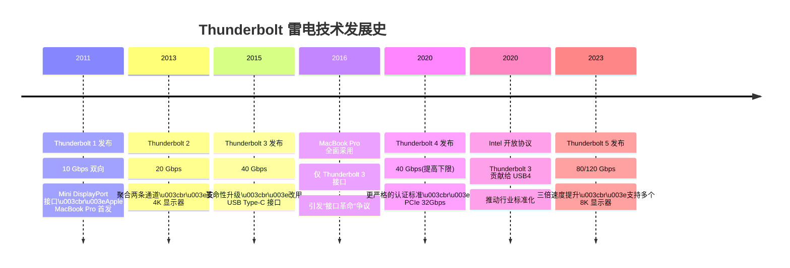
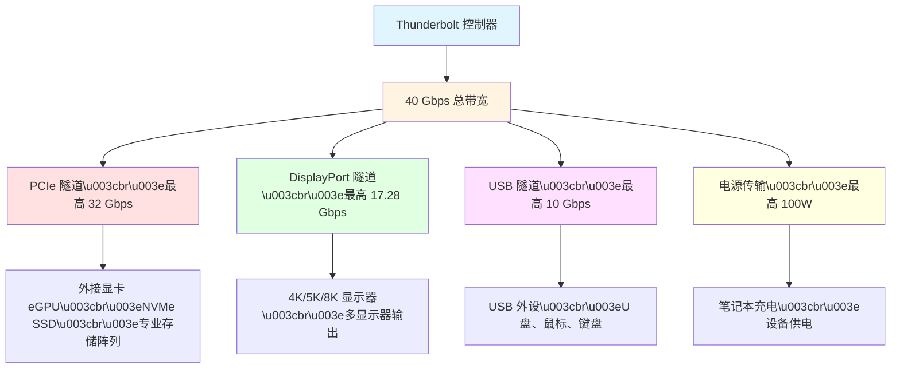
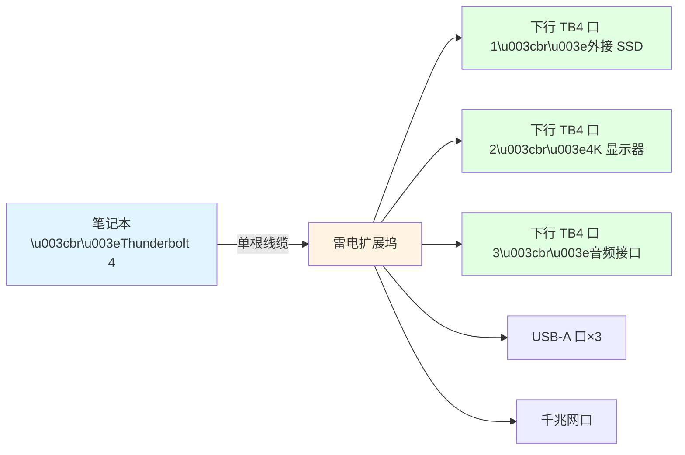
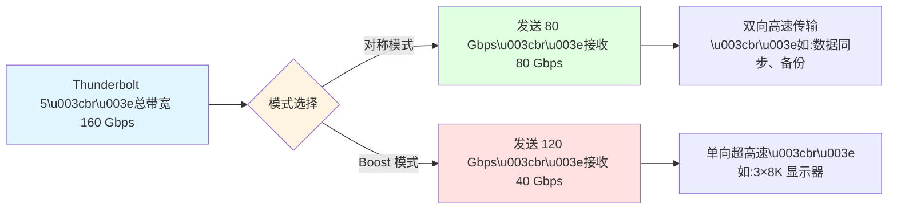
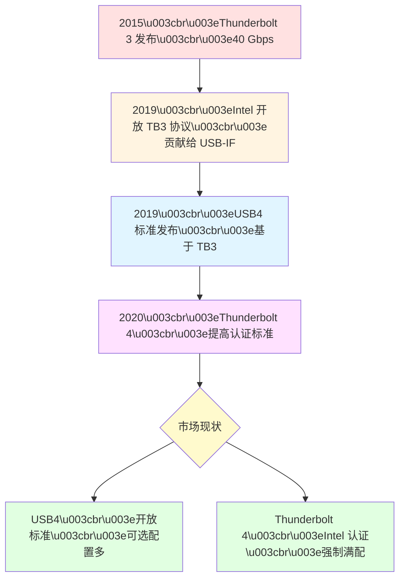
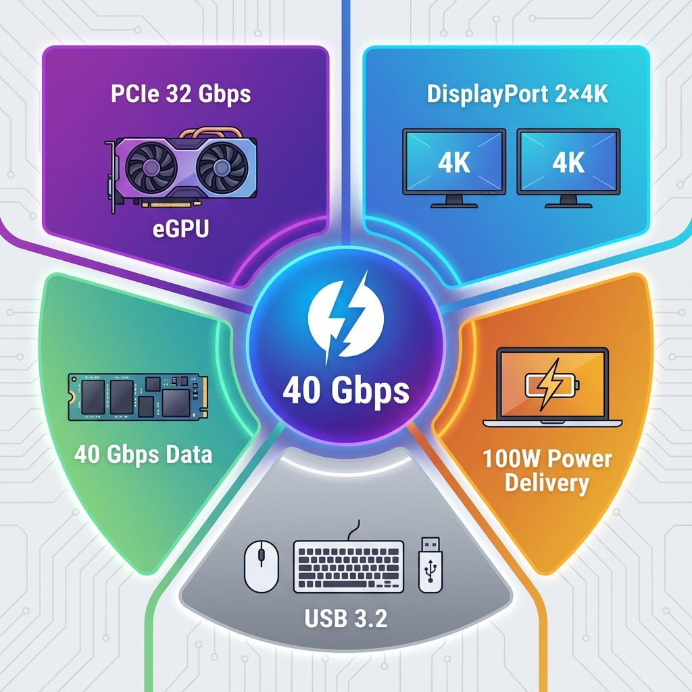

# 第 4 章：Thunderbolt (雷电) 技术 (Thunderbolt Technology)

Thunderbolt 是由 **Intel 和 Apple** 联合开发的高性能接口技术,以"**极速**"和"**全能**"著称。它将 PCIe、DisplayPort 和电源传输整合到一根线缆中,是目前消费级市场上速度最快、功能最全面的接口标准。

## 为什么需要 Thunderbolt?

在 Thunderbolt 出现之前,专业用户面临诸多困扰:

-   **外接显卡性能瓶颈**:USB 速度太慢,无法满足 eGPU 的带宽需求
-   **多显示器连接复杂**:需要多个不同接口(HDMI、DP、DVI)
-   **专业存储速度不足**:即使是 USB 3.0,对于 4K/8K 视频剪辑仍然太慢
-   **扩展坞功能受限**:无法通过一个接口实现所有功能
-   **桌面整洁性差**:各种线缆杂乱无章

**Thunderbolt 的解决方案**:

-   ⚡ **极速传输**: 40 Gbps(Thunderbolt 3/4)甚至 120 Gbps(Thunderbolt 5)
-   🎮 **外接显卡**: 通过 PCIe 连接 eGPU,笔记本秒变游戏主机
-   🖥️ **多显示器**: 一根线驱动 2-4 个 4K 显示器
-   🔌 **一线连**: 扩展坞 + 充电 + 数据 + 视频,只需一根线
-   🔗 **菊花链**: 串联最多 6 个设备,减少接口占用

> [!IMPORTANT]
> Thunderbolt 最初是为**专业创作者**设计的,后来逐渐普及到消费市场。它是 MacBook Pro、高端 Windows 笔记本和工作站的标配接口。

---

## Thunderbolt 技术演进史



---

## Thunderbolt 工作原理

### 核心技术:隧道协议

Thunderbolt 的核心创新是 **Protocol Tunneling(协议隧道)** 技术,将多种协议封装到同一物理连接中:



**动态带宽分配**:

Thunderbolt 控制器会根据实际需求**实时分配带宽**:

| 使用场景 | PCIe | DisplayPort | USB | 说明 |
|---------|------|-------------|-----|------|
| **纯数据传输** | 32 Gbps | 0 | 8 Gbps | 外接 NVMe SSD |
| **单 4K 显示器 + 数据** | 16 Gbps | 12 Gbps | 8 Gbps | 日常办公 |
| **双 4K 显示器** | 8 Gbps | 25 Gbps | 5 Gbps | 设计师工作站 |
| **eGPU + 显示器** | 28 Gbps | 8 Gbps | 2 Gbps | 游戏/渲染 |

> [!NOTE]
> 这种动态分配机制是 Thunderbolt 优于 USB 的关键优势之一。USB4 借鉴了这一技术,但 Thunderbolt 的实现更加成熟。

---

## Thunderbolt 各代对比

### 完整版本对照表

| 对比项 | Thunderbolt 1 | Thunderbolt 2 | Thunderbolt 3 | Thunderbolt 4 | Thunderbolt 5 |
|-------|--------------|--------------|--------------|--------------|--------------|
| **发布年份** | 2011 | 2013 | 2015 | 2020 | 2023 |
| **最高速度** | 10 Gbps | 20 Gbps | 40 Gbps | 40 Gbps | **120 Gbps** |
| **接口类型** | Mini DP | Mini DP | **Type-C** | Type-C | Type-C |
| **PCIe 带宽** | 10 Gbps | 20 Gbps | 16-32 Gbps | **32 Gbps 强制** | 64 Gbps |
| **DisplayPort** | 1.1a | 1.2 | 1.2/1.4 | 1.4 | 2.1 |
| **最大显示器** | 1×2K | 1×4K | 2×4K 或 1×5K | **2×4K 强制** | 3×4K 或 2×8K |
| **USB 兼容** | ❌ | ❌ | ✅ USB 3.1 | ✅ USB4 | ✅ USB4 v2 |
| **最高功率** | N/A | N/A | 100W | 100W | 140W(EPR) |
| **菊花链设备** | 6 个 | 6 个 | 6 个 | 6 个 | 6 个 |
| **线材长度** | 3m(被动) | 3m(被动) | 0.8m(被动 40G)\u003cbr\u003e2m(主动) | 0.8m(被动)\u003cbr\u003e2m(主动) | 1m(被动 80G)\u003cbr\u003e3m(主动) |
| **DMA 保护** | ❌ | ❌ | 可选 | **强制**(VT-d) | 强制 |
| **主要应用** | Mac 专业用户 | Mac/PC 高端 | 广泛普及 | 认证标准化 | 未来旗舰 |

---

### Thunderbolt 1 & 2:早期探索

#### Thunderbolt 1 (2011)

-   **接口**: Mini DisplayPort
-   **速度**: 10 Gbps(双向,每个方向 10 Gbps)
-   **首发设备**: Apple MacBook Pro(2011 款)
-   **技术**: 基于 Intel Light Peak 光纤传输原型(最终采用铜缆)

**局限性**:
-   ❌ 接口罕见,仅 Apple 和少数高端 PC 采用
-   ❌ 配件昂贵(雷电线材当时售价 $50+)
-   ❌ 市场认知度低

#### Thunderbolt 2 (2013)

-   **速度**: 20 Gbps(聚合两条 10 Gbps 通道)
-   **改进**: 支持 4K@60Hz 显示器
-   **应用**: 专业视频剪辑、音频制作

**改进**:
-   ✅ 带宽翻倍,满足 4K 视频需求
-   ✅ 更多 PC 厂商加入(Dell、HP 工作站)

**持续的问题**:
-   ❌ 依然使用 Mini DP 接口,普及困难
-   ❌ 价格高昂,消费市场接受度低

---

### Thunderbolt 3:革命性突破

2015 年的 Thunderbolt 3 是最重要的里程碑,真正将雷电技术从"小众专业"推向"主流市场"。

#### 核心改进

**1. 采用 USB Type-C 接口** 🔌

这是最重要的决策:
-   ✅ 通用性大幅提升,与 USB-C 设备兼容
-   ✅ 正反盲插,用户体验改善
-   ✅ 推动整个行业向 Type-C 转型
-   ⚠️ 但也带来混淆:"看起来像 Type-C"的接口可能是 USB 3.x 或 Thunderbolt

**2. 速度翻倍至 40 Gbps** ⚡

-   双向带宽均为 40 Gbps
-   支持 **PCIe 3.0 x4**(32 Gbps)
-   外接显卡(eGPU)成为可能

**3. 支持 USB 3.1** 🔗

-   向下兼容 USB 3.1 Gen 2(10 Gbps)
-   可以连接普通 USB-C 设备
-   Thunderbolt 3 接口可作为 USB 接口使用

**4. 视频输出增强** 🖥️

-   支持 **2 个 4K@60Hz** 或 **1 个 5K@60Hz** 显示器
-   DisplayPort 1.2 HBR2(17.28 Gbps)

**5. 供电能力** 🔋

-   支持 USB PD,最高 **100W**(20V 5A)
-   笔记本可通过 Thunderbolt 充电

#### 技术规格

| 技术参数 | 规格 |
|---------|------|
| **速度** | 40 Gbps(每个方向) |
| **接口** | USB Type-C |
| **PCIe** | Gen 3.0 x4(最高 32 Gbps) |
| **DisplayPort** | 1.2 HBR2 / 1.4 HBR3 |
| **USB** | USB 3.1 Gen 2(10 Gbps) |
| **供电** | USB PD 3.0(最高 100W) |
| **菊花链** | 最多 6 个设备 |
| **线材** | 被动线:0.5m(40Gbps)\u003cbr\u003e主动线:1-2m(40Gbps) |

#### Thunderbolt 3 的变种问题

**Intel 提供了两种控制器**:

**Alpine Ridge(标准版)**:
-   PCIe 带宽: 16 Gbps
-   双路 4K 支持: 可选
-   价格: 较低

**Titan Ridge(高性能版)**:
-   PCIe 带宽: **32 Gbps**
-   双路 4K 支持: 强制
-   DisplayPort 1.4: 支持
-   价格: 较高

> [!WARNING]
> 这导致市场上的 Thunderbolt 3 设备性能差异很大。同样标注"Thunderbolt 3",有的只有 16 Gbps PCIe,有的有 32 Gbps。这也是 Thunderbolt 4 要解决的问题。

---

### Thunderbolt 4:标准化与提高下限

Thunderbolt 4 并未提升最高带宽(依然 40 Gbps),而是**提高了最低标准**,确保一致的用户体验。

#### 强制性要求

**1. PCIe 带宽强制 32 Gbps** 💪

-   Thunderbolt 3 允许 16 Gbps
-   Thunderbolt 4 **必须** 32 Gbps
-   保证 eGPU 和高速 SSD 性能

**2. 双路 4K 显示器强制支持** 🖥️🖥️

-   Thunderbolt 3 可选
-   Thunderbolt 4 **必须**支持 2×4K@60Hz 或 1×8K@60Hz

**3. 雷电扩展坞(Hub)支持** 🔌

-   Thunderbolt 3 仅支持菊花链(串联)
-   Thunderbolt 4 支持**分支扩展坞**(1 分 3)



**4. DMA 保护强制** 🔒

-   **Intel VT-d DMA 保护**:防止恶意 Thunderbolt 设备通过 DMA 攻击系统内存
-   Thunderbolt 3 可选,Thunderbolt 4 **强制**

**5. 支持 USB4** 🔗

-   完全兼容 USB4 标准
-   USB4 设备可在 TB4 接口上使用
-   TB4 设备可在 USB4 接口上使用(但可能功能受限)

**6. 线材要求更严格** 📏

-   **被动线缆**:最长 **0.8m**,必须支持 40 Gbps
-   **主动线缆**:最长 **2m**,必须支持 40 Gbps
-   所有 TB4 线缆必须支持 USB4、TB3、USB 3.2、USB 2.0
-   所有 TB4 线缆必须支持 100W USB PD 充电

#### Thunderbolt 4 vs Thunderbolt 3 总结

| 对比项 | Thunderbolt 3 | Thunderbolt 4 |
|-------|--------------|--------------|
| **最高速度** | 40 Gbps | 40 Gbps(相同) |
| **PCIe** | 16 Gbps(低端)\u003cbr\u003e32 Gbps(高端) | **32 Gbps 强制** |
| **显示器** | 1-2 个 4K(可选) | **2 个 4K 强制** |
| **扩展坞** | 仅菊花链 | **支持分支扩展坞** |
| **DMA 保护** | 可选 | **VT-d 强制** |
| **USB4** | 不兼容 | **完全兼容** |
| **线材长度** | 0.5-2m | **0.8m(被动)** |
| **认证** | 较宽松 | **极严格** |

> [!IMPORTANT]
> **购买建议**:Thunderbolt 4 的认证更严格,意味着**质量更有保障**。即使速度相同,Thunderbolt 4 设备的一致性和兼容性更好。

---

### Thunderbolt 5:未来已来

2023 年 9 月,Intel 发布了 **Thunderbolt 5**,速度实现质的飞跃。

#### 核心规格

-   **速度(对称)**: 80 Gbps(双向各 80 Gbps)
-   **速度(非对称 Bandwidth Boost)**: 120 Gbps(单向)+ 40 Gbps(反向)
-   **PCIe**: Gen 4.0 x4(64 Gbps)
-   **DisplayPort**: 2.1(80 Gbps)
-   **USB**: USB4 v2(80 Gbps)
-   **供电**: USB PD 3.1 EPR(最高 140W,28V 5A)

#### Bandwidth Boost 技术

这是 Thunderbolt 5 的创新功能:

**对称模式**(默认):
-   发送: 80 Gbps
-   接收: 80 Gbps
-   总计: 160 Gbps

**非对称模式**(Boost):
-   发送(如视频输出): **120 Gbps**
-   接收(如键鼠输入): 40 Gbps
-   应用: 需要大量单向带宽的场景(如多个 8K 显示器)



#### 应用场景

**1. 多显示器支持**
-   3× 4K@144Hz
-   2× 8K@60Hz
-   1× 16K (未来)

**2. 外接显卡 eGPU**
-   PCIe 4.0 x4(64 Gbps)
-   性能损失更小(约 10%,Thunderbolt 3/4 约 15-20%)

**3. 超高速存储**
-   PCIe 4.0 NVMe SSD 可完全发挥性能
-   读写速度可达 **8000+ MB/s**

#### 现状与未来

-   **标准发布**: 2023 年 9 月
-   **芯片可用**: 2024 年
-   **预计普及**: 2025-2026 年
-   **首批设备**: 预计 2024 年底的高端笔记本和扩展坞

> [!NOTE]
> Thunderbolt 5 设备目前(2024 年底)仍处于起步阶段,市场上产品很少,价格昂贵。对于大多数用户,Thunderbolt 4 仍是当前的最佳选择。

---

## Thunderbolt vs USB4 深度对比

很多人混淆 Thunderbolt 和 USB4,这里详细说明两者的关系与区别。

### 历史渊源



### 详细对比

| 对比项 | USB4 | Thunderbolt 4 |
|-------|------|--------------|
| **性质** | 开放标准(USB-IF) | Intel 认证标准 |
| **最低速度** | 20 Gbps | **40 Gbps 强制** |
| **最高速度** | 40 Gbps | 40 Gbps |
| **PCIe** | **可选**(0-32 Gbps) | **强制 32 Gbps** |
| **DisplayPort** | 可选 | **强制**(2×4K) |
| **USB 3.2** | 强制 | 强制 |
| **菊花链** | 支持 | 支持 |
| **扩展坞** | 不要求 | **要求支持** |
| **DMA 保护** | 不要求 | **VT-d 强制** |
| **线材认证** | 宽松 | **极严格** |
| **认证费用** | 免费 | 需向 Intel 付费 |
| **认证周期** | 较短 | 较长 |
| **市场定位** | 大众市场 | 专业/高端市场 |

### 兼容性矩阵

| 设备 | 接口 | 能否连接 | 实际性能 |
|------|------|---------|---------|
| **Thunderbolt 4 设备** | Thunderbolt 4 接口 | ✅ | 满性能(40G + PCIe 32G) |
| Thunderbolt 4 设备 | USB4 接口 | ✅ | 取决于 USB4 实现\u003cbr\u003e可能无 PCIe |
| Thunderbolt 4 设备 | USB 3.2 接口 | ✅ | 降速至 10-20 Gbps |
| Thunderbolt 4 设备 | Thunderbolt 3 接口 | ✅ | 满性能 |
| **USB4 设备** | Thunderbolt 4 接口 | ✅ | USB4 设备的最高性能 |
| USB4 设备 | USB4 接口 | ✅ | 取决于双方最低规格 |
| **Thunderbolt 3 设备** | Thunderbolt 4 接口 | ✅ | 满性能 |
| Thunderbolt 3 设备 | USB4 接口 | ⚠️ | 取决于 USB4 的 TB3 兼容 |

> [!IMPORTANT]
> **购买建议**:
> - 如果**预算充足**且需要**稳定可靠**的性能 → 选择 **Thunderbolt 4**
> - 如果只需要**高速数据传输**,无需 PCIe(eGPU) → **USB4** 即可
> - 如果主要用于**充电和普通 USB 设备** → **USB 3.2** 足够

---

### 为什么 Thunderbolt 4 更贵?

| 成本项 | USB4 | Thunderbolt 4 |
|-------|------|--------------|
| **控制器芯片** | 多种选择,价格 $5-30 | Intel 专用,$30-50 |
| **认证费用** | 免费 | 需向 Intel 支付认证费 |
| **测试成本** | 基础测试 | 严格的互操作性测试 |
| **线材成本** | 普通线材 | 必须主动线材(内置芯片) |
| **PCB 设计** | 简单 | 复杂(需支持所有功能) |

**最终价格差异**:
-   USB4 扩展坞: ¥300-800
-   Thunderbolt 4 扩展坞: ¥1000-3000
-   差价: **2-4 倍**

---

## Thunderbolt 核心特性详解

### 1. 菊花链(Daisy Chain)

菊花链允许**串联最多 6 个设备**,减少占用电脑接口。

#### 工作原理

```mermaid
graph LR
    A[笔记本\u003cbr\u003eThunderbolt 接口] -->|TB 线缆| B[设备 1\u003cbr\u003e显示器]
    B -->|TB 线缆| C[设备 2\u003cbr\u003e外置 SSD]
    C -->|TB 线缆| D[设备 3\u003cbr\u003e音频接口]
    D -->|TB 线缆| E[设备 4\u003cbr\u003eUSB Hub]
    E -->|TB 线缆| F[设备 5\u003cbr\u003e以太网适配器]
    F -->|TB 线缆| G[设备 6\u003cbr\u003e外接硬盘]
    
    style A fill:#e1f5ff
    style B fill:#fff4e1
    style C fill:#fffacd
    style D fill:#e1ffe1
    style E fill:#ffe1e1
    style F fill:#ffe1ff
    style G fill:#ffffe1
```



#### 菊花链规则

**设备计数方式**:
-   **Thunderbolt 设备**:计入 6 个限制
-   **DisplayPort 显示器**:计为最后一个设备(终端)
-   **USB 设备**(通过 TB Hub):不计入

**带宽共享**:

所有设备**共享 40 Gbps 带宽**:

| 菊花链配置 | 每个设备可用带宽 |
|-----------|----------------|
| 1 个 4K 显示器 | 约 32 Gbps 可用于其他设备 |
| 2 个 4K 显示器 | 约 12 Gbps 可用于其他设备 |
| 1 个 eGPU + 显示器 | eGPU: 28G,显示器: 8G,其他: 4G |

> [!WARNING]
> **菊花链的限制**:
> - 每增加一个设备,延迟会轻微增加
> - 带宽需合理分配,否则可能影响性能
> - 链条中任何一个设备断开,后续所有设备都会断开
> - 不是所有 Thunderbolt 设备都支持菊花链(需查看规格)

---

### 2. PCIe 支持:eGPU 的关键

Thunderbolt 独有的 **PCIe 隧道**使得外接显卡成为可能。

#### eGPU 工作原理

```mermaid
graph TB
    A[笔记本 CPU/内存] -->|Thunderbolt 4\u003cbr\u003ePCIe 3.0 x4| B[eGPU 显卡盒]
    
    B --> C[GPU\u003cbr\u003e如 RTX 4070]
    B --> D[电源供应\u003cbr\u003e400-750W]
    
    C --> E[视频输出]
    E --> F[外接显示器\u003cbr\u003e4K@144Hz]
    
    C -.回传给笔记本.-> G[笔记本内置屏幕]
    
    style A fill:#e1f5ff
    style B fill:#fff4e1
    style C fill:#ffe1e1
    style D fill:#ffffe1
    style E fill:#e1ffe1
    style F fill:#ffe1ff
    style G fill:#fffacd
```

#### eGPU 性能损失

由于 Thunderbolt 带宽限制,eGPU 相比台式机会有性能损失:

| GPU 型号 | 台式机性能 | eGPU(TB3/4) 性能 | 损失幅度 |
|---------|-----------|-----------------|---------|
| RTX 4060 | 100% | 85-90% | 10-15% |
| RTX 4070 | 100% | 80-85% | 15-20% |
| RTX 4090 | 100% | 70-75% | 25-30% |

**损失来源**:
-   PCIe 3.0 x4(32 Gbps) vs 台式机 PCIe 4.0 x16(256 Gbps)
-   延迟增加
-   回传到笔记本屏幕时需占用带宽

> [!TIP]
> **eGPU 最佳实践**:
> - 使用**外接显示器**(直连 GPU,无需回传)
> - 选择**中高端 GPU**(RTX 4060-4070 Ti),旗舰卡损失太大
> - 确保笔记本 Thunderbolt 支持 **32 Gbps PCIe**(TB4 或高端 TB3)
> - 游戏时关闭笔记本内置屏幕

---

### 3. 供电能力

Thunderbolt 支持 USB PD,可为笔记本充电。

| Thunderbolt 版本 | 最高功率 | 实际应用 |
|-----------------|---------|---------|
| Thunderbolt 3 | 100W(20V 5A) | 轻薄本充电 |
| Thunderbolt 4 | 100W(20V 5A) | 轻薄本充电 |
| Thunderbolt 5 | **140W**(28V 5A, EPR) | 高性能笔记本 |

**一线连应用**:

通过雷电扩展坞实现:
-   ⚡ 笔记本充电(65-100W)
-   🖥️ 视频输出(2 个 4K 显示器)
-   💾 数据传输(外接 SSD、U 盘)
-   🌐 有线网络(千兆/2.5G 网口)
-   🎧 音频输出(DAC、耳放)
-   🖱️ USB 外设(鼠标、键盘、摄像头)

**单根线缆**连接,拔插即走,桌面整洁。

---

## Thunderbolt 设备识别与购买

### 如何识别 Thunderbolt 接口?

#### 1. 查看标识符号

**Thunderbolt 3/4/5**:
-   ⚡ **闪电标志**(Thunderbolt Logo)
-   数字标注:"3"、"4"、"5"
-   可能还有 "40" 或 "USB4" 字样

**示例**:
-   ⚡ = Thunderbolt 3
-   ⚡ 4 = Thunderbolt 4
-   ⚡ 5 = Thunderbolt 5

> [!WARNING]
> 有些廉价设备使用类似闪电的图标但实际不是 Thunderbolt!必须查看官方规格确认。

#### 2. 查看系统信息

**macOS**:
1. 点击 Apple 菜单 →"关于本机"→"系统报告"
2. 选择"Thunderbolt"或"USB"
3. 查看接口速度和控制器类型

**Windows**:
1. 右键"此电脑"→"管理"→"设备管理器"
2. 展开"系统设备"
3. 查找"Thunderbolt(TM) Controller"

**Linux**:
```bash
lspci | grep Thunderbolt
sudo dmesg | grep thunderbolt
```

#### 3. 物理特征(Type-C 接口)

Thunderbolt 3/4/5 都使用 Type-C,但有细微差别:
-   接口旁边有 ⚡ 标志
-   通常是全功能接口(支持视频+充电+数据)
-   MacBook Pro 的 Thunderbolt 接口通常在左侧

---

### Thunderbolt 设备购买指南

#### 线材选购

| 用途 | 推荐规格 | 长度 | 价格区间 | 注意事项 |
|------|---------|------|---------|---------|
| **TB3 被动线** | 40 Gbps | ≤0.5m | ¥80-200 | 短,适合桌面 |
| **TB3 主动线** | 40 Gbps | 1-2m | ¥200-500 | 内置芯片,更贵 |
| **TB4 认证线** | 40 Gbps | ≤0.8m | ¥150-300 | 认证标识,兼容性好 |
| **TB4 主动线** | 40 Gbps | 2m | ¥300-800 | 最灵活 |

**认证标识**:
-   ✅ Intel Thunderbolt Certified
-   ✅ 50 数字(代表 USB PD 5A 支持)
-   ✅ SS 40(代表 40 Gbps)

---

#### 扩展坞选购

**入门级(¥800-1500)**:
-   1 个 TB4 上行口
-   2-3 个 USB-A
-   1 个 HDMI 2.0(4K@60Hz)
-   千兆网口
-   65W 供电
-   **品牌**: CalDigit、Belkin、Anker

**中端(¥1500-2500)**:
-   1 个 TB4 上行口
-   2-3 个下行 TB4 口
-   多个 USB-A/C
-   双 HDMI 或 DP(双 4K)
-   2.5G 网口
-   85-96W 供电
-   SD 卡槽
-   **品牌**: OWC、CalDigit TS4

**高端(¥2500-4000+)**:
-   3 个下行 TB4 口
-   DisplayPort 1.4
-   10G 以太网
-   96-100W 供电
-   音频 DAC
-   **品牌**: OWC Thunderbolt Dock、CalDigit TS4

> [!TIP]
> **扩展坞选购要点**:
> 1. **供电瓦数**:确保满足笔记本需求(查看原装充电器功率)
> 2. **下行 TB 口数量**:需要连接其他 TB 设备(如 SSD)时很重要
> 3. **视频输出**:确认支持的显示器数量和分辨率
> 4. **网口速度**:视频剪辑等需要 2.5G 或 10G
> 5. **品牌认证**:选择 Intel 认证产品,兼容性更好

---

#### 存储设备选购

| 设备类型 | 推荐速度 | 价格区间(1TB) | 代表产品 |
|---------|---------|--------------|---------|
| **TB3 HDD** | 约 200 MB/s | ¥600-1000 | LaCie、G-Tech |
| **TB3 SATA SSD** | 约 500 MB/s | ¥800-1500 | Samsung X5 |
| **TB3 NVMe SSD** | 1500-2800 MB/s | ¥1500-3000 | Samsung X5、OWC Envoy Pro |
| **TB4 NVMe SSD** | 2000-3000 MB/s | ¥2000-4000 | OWC Envoy Pro、Acasis |

---

#### eGPU 显卡盒选购

| 品牌/型号 | 电源 | PCIe 支持 | 额外接口 | 价格 |
|----------|------|----------|---------|------|
| **Razer Core X** | 650W | x16(TB@x4) | 4×USB, 千兆网 | ¥2000-2800 |
| **Sonnet eGFX Breakaway Box** | 550W | x16 | 无 | ¥1500-2200 |
| **AORUS Gaming Box** | 450W | x16 | 3×USB | ¥2500-3500(含 GPU) |

**选购要点**:
-   电源功率 ≥ GPU TDP + 100W
-   查看 GPU 兼容性列表
-   macOS 用户需确认 GPU 支持(AMD 卡兼容性更好)

---

## Thunderbolt 常见应用场景

### 场景 1:视频编辑工作站 🎬

**配置**:
-   MacBook Pro 16"(M3 Max,Thunderbolt 4)
-   OWC Thunderbolt Dock(3×TB4 下行)
-   2× 4K 显示器(通过扩展坞)
-   外置 4TB NVMe SSD(TB4,素材盘)
-   8TB HDD(备份盘,USB)

**一线连优势**:
-   到公司:插入一根雷电线,所有外设连接完成
-   回家:拔出,带走笔记本
-   传输 4K 素材:2500 MB/s,100GB 用时 40 秒

---

### 场景 2:轻薄本 + eGPU 游戏方案 🎮

**配置**:
-   轻薄本(Thunderbolt 4)
-   Razer Core X eGPU Box
-   RTX 4070 显卡
-   外接 2K@165Hz 显示器

**优势**:
-   便携:出差时仅带轻薄本(1.3kg)
-   游戏:回家连接 eGPU,性能提升 5-8 倍
-   成本:比游戏本 + 轻薄本便宜

**实测性能**:
-   《赛博朋克 2077》:2K 高画质 80-100 FPS
-   《原神》:2K 极高画质 120 FPS
-   性能损失:约 15%(可接受)

---

### 场景 3:音乐制作工作站 🎵

**配置**:
-   MacBook Pro 14"
-   Universal Audio Apollo Twin(雷电音频接口)
-   外接 MIDI 键盘(USB)
-   监听音箱

**优势**:
-   **超低延迟**:雷电音频接口延迟 <2ms(USB 通常 5-10ms)
-   **DSP 处理**:Apollo 内置 DSP,实时效果器无需占用 CPU
-   **多通道**:同时录制 10+ 轨道无压力

---

### 场景 4:摄影师移动工作站 📷

**配置**:
-   MacBook Pro 16"
-   OWC Envoy Pro(2TB NVMe SSD,雷电)
-   SD 卡读卡器(USB-C)
-   CalDigit TS4 扩展坞(外场使用车载逆变器供电)

**工作流**:
1. 外场拍摄(SD 卡)
2. 通过读卡器导入雷电 SSD(速度 500+ MB/s)
3. 直接在 SSD 上编辑(Lightroom、Photoshop)
4. 回工作室:连接扩展坞,自动备份到 NAS

**效率提升**:
-   导入 64GB RAW 照片:约 2 分钟(USB 3.0 需 10+ 分钟)
-   编辑大型 PSD 文件:读写速度 2500 MB/s,无卡顿

---

## 常见问题 FAQ

### Q1: Thunderbolt 和 USB-C 是一回事吗?

**答**: **不是**。

-   **USB-C**: 只是**接口形态**(物理形状),Type-C 接口可能是:
    -   USB 2.0(480 Mbps)
    -   USB 3.2(10-20 Gbps)
    -   USB4(20-40 Gbps)
    -   Thunderbolt 3/4/5(40-120 Gbps)

-   **Thunderbolt**: 是**传输协议**,Thunderbolt 3/4/5 都使用 Type-C 接口,但 Type-C ≠ Thunderbolt

**识别方法**: 查看 ⚡ 标志或产品规格

---

### Q2: 我的电脑有 Type-C 口,能用 Thunderbolt 设备吗?

**答**: 不一定,需要查看 Type-C 接口的具体规格。

**兼容性判断**:

| 你的电脑接口 | Thunderbolt 设备 | 能否使用 | 性能 |
|------------|----------------|---------|------|
| **Thunderbolt 4** | TB4/TB3 设备 | ✅ 完全兼容 | 满性能 |
| **Thunderbolt 3** | TB4/TB3 设备 | ✅ 兼容 | 满性能(TB3 规格内) |
| **USB4** | TB4/TB3 设备 | ⚠️ 部分兼容 | 可能无 PCIe 功能 |
| **USB 3.2** | TB 设备 | ⚠️ 降级使用 | 仅 USB 功能,无 TB 特性 |
| **USB 2.0 Type-C** | TB 设备 | ⚠️ 极低性能 | 480 Mbps,无意义 |

> [!IMPORTANT]
> eGPU、雷电扩展坞等专业设备**必须**连接真正的 Thunderbolt 接口才能工作。普通 USB-C 无法使用。

---

### Q3: Thunderbolt 线材这么贵,能用便宜的替代吗?

**答**: 取决于用途。

**可以用便宜线材的情况**:
-   ✅ 仅用于充电
-   ✅ 连接普通 USB 设备(U 盘、鼠标)
-   ✅ 短距离(<0.5m)低速传输

**必须用雷电认证线材**:
-   ❌ 40 Gbps 数据传输
-   ❌ eGPU 连接
-   ❌ 菊花链多个设备
-   ❌ 100W 充电(需 5A E-Marker 线)
-   ❌ 长距离(>1m)高速传输

**风险**:
-   劣质线材可能损坏设备
-   速度不达标
-   充电功率受限或发热

> [!WARNING]
> Thunderbolt 线材内有主动芯片,成本确实高。不要用 ¥20 的杂牌线连接 ¥20000 的设备!

---

### Q4: Mac 和 Windows PC 的 Thunderbolt 有区别吗?

**答**: 协议相同,但兼容性和支持程度有差异。

| 对比项 | Mac | Windows PC |
|-------|-----|-----------|
| **Thunderbolt 支持** | 全系列 MacBook Pro/Air | 仅高端笔记本/台式机 |
| **认证严格度** | Apple 严格控制 | 参差不齐 |
| **驱动支持** | 内置,免驱 | 需安装驱动 |
| **eGPU 支持** | macOS 原生支持(仅 AMD 卡) | Windows 支持广泛(NVIDIA/AMD) |
| **启动保护** | 默认禁用外部启动 | 需 BIOS 设置 |
| **热插拔** | 完美支持 | 部分设备需重启 |

**购买建议**:
-   **Mac 用户**: eGPU 选 AMD 卡(RX 6000/7000 系列)
-   **Windows 用户**: eGPU 选 NVIDIA(RTX 系列,游戏优化更好)

---

### Q5: Thunderbolt 设备连接后没反应,怎么办?

**常见问题排查**:

**1. 确认接口类型**
-   查看电脑接口是否真的是 Thunderbolt(有 ⚡ 标志)
-   查看系统信息确认 Thunderbolt 控制器存在

**2. 检查线材**
-   使用 Thunderbolt 认证线材
-   尝试更换线材

**3. 驱动和固件**
-   **Windows**: 安装 Intel Thunderbolt 驱动
-   **Mac**: 更新 macOS 到最新版本
-   更新设备固件(如扩展坞、eGPU)

**4. BIOS/安全设置**
-   **Windows PC**: 进入 BIOS,启用 Thunderbolt
-   检查是否禁用了"Thunderbolt Boot Support"
-   **Mac**: 系统偏好设置 → 安全性 → 允许 Thunderbolt 附件

**5. 供电问题**
-   确保笔记本电源适配器已连接(Thunderbolt 高功耗)
-   eGPU 电源是否正常供电

**6. 重置 SMC/NVRAM(Mac)**
```
SMC: 关机 → 按住 Shift+Control+Option+电源键 10 秒
NVRAM: 重启时按住 Command+Option+P+R,听到启动声后松开
```

---

### Q6: Thunderbolt 安全吗?有哪些安全风险?

**主要安全风险**:

**1. DMA 攻击(Direct Memory Access)**

-   恶意 Thunderbolt 设备可直接访问系统内存
-   窃取密码、密钥等敏感信息
-   **防护措施**:
    -   使用 Thunderbolt 4(强制 VT-d DMA 保护)
    -   Windows: 启用"Kernel DMA Protection"
    -   Mac: 系统偏好设置 → 安全性 → Thunderbolt 附件审批

**2. Thunderspy 攻击**

-   2020 年发现的硬件层面漏洞
-   影响 Thunderbolt 1/2/3(2019 年前)
-   **防护措施**:
    -   使用 Thunderbolt 4(已修复)
    -   更新主板固件
    -   启用 Secure Boot

**安全最佳实践**:

-   ✅ 不连接来源不明的 Thunderbolt 设备
-   ✅ 使用系统的 Thunderbolt 设备授权功能
-   ✅ 及时更新驱动和固件
-   ✅ 启用全盘加密(FileVault、BitLocker)
-   ✅ 使用 Thunderbolt 4 设备

---

### Q7: Thunderbolt 5 什么时候普及?现在值得等吗?

**Thunderbolt 5 现状(2024 年底)**:

-   **标准发布**: 2023 年 9 月
-   **芯片供应**: 2024 年开始
-   **首批产品**: 预计 2024 年底-2025 年初
-   **大规模普及**: 预计 2025-2026 年

**价格预期**:
-   首批设备会非常昂贵(溢价 50-100%)
-   预计 2026 年价格趋于合理

**购买建议**:

**立即购买 Thunderbolt 4** 如果:
-   ✅ 当前需要使用(不能等 1-2 年)
-   ✅ Thunderbolt 4 的 40 Gbps 已满足需求
-   ✅ 预算有限(TB5 设备初期极贵)

**等待 Thunderbolt 5** 如果:
-   ✅ 需要 3 个以上 4K 显示器或 2 个 8K 显示器
-   ✅ 需要多个超高速 NVMe SSD 同时工作
-   ✅ 预算充足,愿意为新技术付费
-   ✅ 可以等待 1-2 年

> [!TIP]
> 对于大多数用户,**Thunderbolt 4 仍是 2024-2025 年的最佳选择**。TB5 的 120 Gbps 速度对普通用途来说是"过剩"的。

---

## 总结对照表

### Thunderbolt 版本快速参考

| 特性 | TB1 | TB2 | TB3 | TB4 | TB5 |
|------|-----|-----|-----|-----|-----|
| **速度** | 10 Gbps | 20 Gbps | 40 Gbps | 40 Gbps | 120 Gbps |
| **接口** | Mini DP | Mini DP | Type-C | Type-C | Type-C |
| **PCIe** | 10G | 20G | 16-32G | **32G 强制** | 64G |
| **显示器** | 1×2K | 1×4K | 2×4K | **2×4K 强制** | 3×4K/2×8K |
| **USB 兼容** | ❌ | ❌ | USB 3.1 | USB4 | USB4 v2 |
| **供电** | - | - | 100W | 100W | 140W |
| **推荐用户** | 已淘汰 | 已淘汰 | 专业用户 | **当前主流** | 未来旗舰 |

---

## 延伸阅读

-   **官方网站**: [Thunderbolt Technology](https://www.thunderbolttechnology.net/)
-   **认证产品**: [Thunderbolt Certified Products](https://thunderbolttechnology.net/products)
-   **技术规范**: [Intel Thunderbolt Specifications](https://www.intel.com/content/www/us/en/architecture-and-technology/thunderbolt/thunderbolt-technology-general.html)
-   **相关章节**:
    -   [第 2 章:USB 接口形态](connector-types.md) - Type-C 接口详解
    -   [第 3 章:USB 传输协议](transfer-protocols.md) - USB4 vs Thunderbolt
    -   [第 5 章:充电与供电](charging-power.md) - USB PD 与 Thunderbolt 充电


