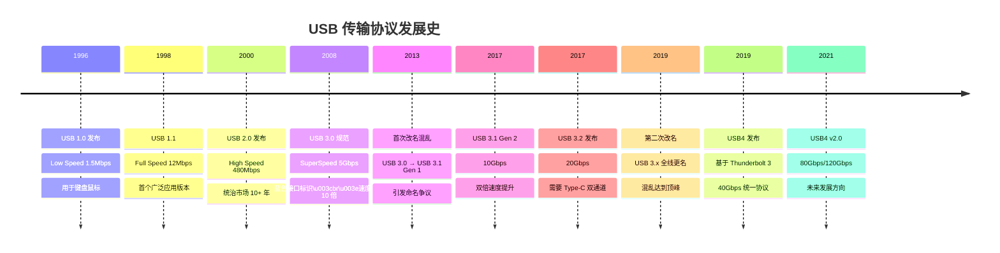
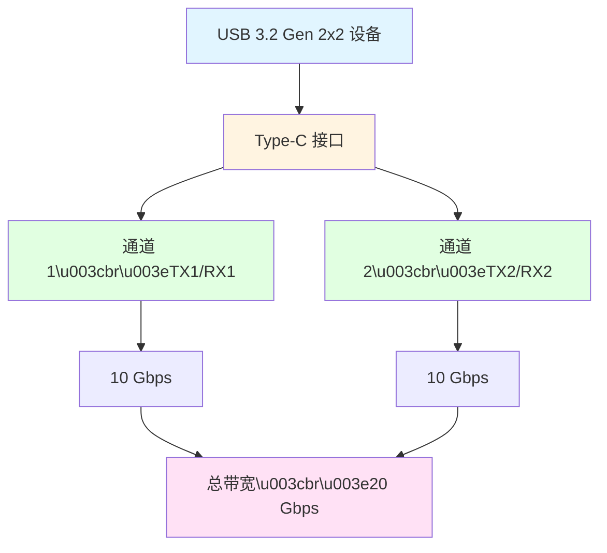
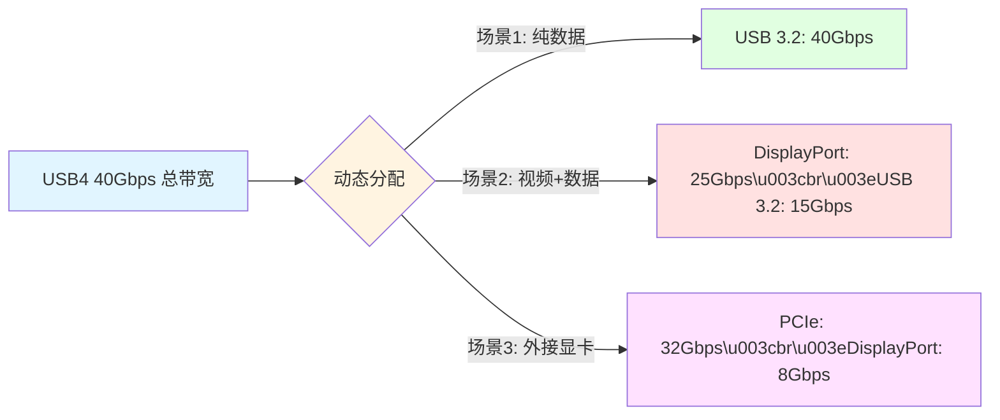
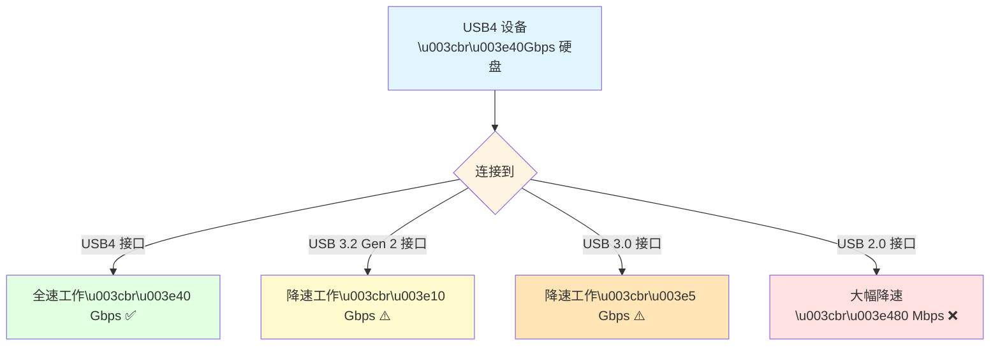
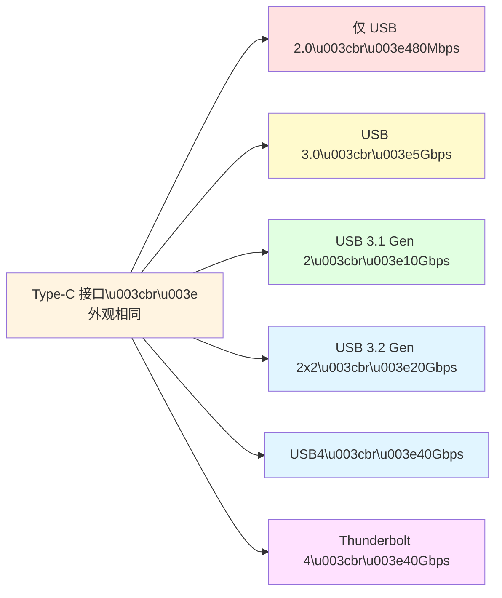

# 第 3 章：USB 传输协议 (USB Transfer Protocols)

USB 协议决定了数据传输的**速度**。然而,由于 USB-IF (USB 开发者论坛) 多次更改命名规则,导致市场上存在大量混淆的名称,这也是消费者购买 USB 设备时最容易踩坑的地方。

## 为什么 USB 速度如此重要?

在购买 USB 设备时,您可能经常遇到这样的困惑:

-   **价格差异巨大**:为什么有的 U 盘只要 20 元,有的却要 200 元?
-   **速度天差地别**:为什么同样是 Type-C 接口,传输速度差别可达 100 倍?
-   **命名令人迷惑**:"USB 3.2 Gen 2x2" 这种名字到底是什么意思?
-   **实际体验差**:为什么标称"高速"的设备,传文件还是很慢?

**真实场景举例**:

-   📱 **备份手机照片**(20GB):
    -   USB 2.0 U 盘:需要约 **10 分钟**
    -   USB 3.2 Gen 2 U 盘:只需约 **30 秒**
-   🎬 **传输 4K 视频素材**(100GB):
    -   USB 2.0 移动硬盘:需要约 **50 分钟**
    -   USB4 SSD:只需约 **30 秒**

速度差异不仅影响效率,更直接影响您的使用体验和时间成本。本章将帮您理清 USB 速度标准的来龙去脉,避免踩坑。

> [!IMPORTANT]
> **USB 速度 ≠ USB 接口形态**。一个 Type-C 接口可能只支持 USB 2.0 速度(480Mbps),也可能支持 USB4(40Gbps)。购买时务必同时确认**接口类型**和**传输协议版本**。

---

## USB 速度演进历史



---

## 早期 USB 标准

### USB 1.0 / 1.1 (1996-2000)

-   **Low Speed**: 1.5 Mbps
    -   **应用**: 键盘、鼠标、游戏手柄
    -   **特点**: 低功耗,适合简单输入设备
-   **Full Speed**: 12 Mbps
    -   **应用**: 打印机、扫描仪、早期摄像头
    -   **特点**: 当时的"全速",但以今天标准看已经很慢

### USB 2.0 (2000)

-   **High Speed**: **480 Mbps** (理论值约 60 MB/s)
-   **实际速度**: 约 30-40 MB/s
-   **应用场景**:
    -   📱 大部分"仅充电线"的数据传输上限
    -   📱 入门级手机的数据接口(如 iPhone 15 基础版)
    -   🖱️ 无线鼠标接收器、蓝牙适配器
    -   ⌨️ 机械键盘、USB 声卡
-   **现状**: **至今仍广泛使用**,是最兼容的标准

> [!NOTE]
> USB 2.0 推出至今已有 **20+ 年**,但仍然是许多设备的默认选择,原因是:
> - 成本极低(主控芯片便宜)
> - 兼容性极好
> - 对于键盘、鼠标等低速设备完全够用

---

## USB 3.x 命名大乱斗

这是最让人头疼的部分。USB-IF 在 2013 年和 2019 年两次更改命名规则,导致市场上同一个标准有多个名字,消费者和厂商都苦不堪言。

### 为什么要改名?

**USB-IF 的官方理由**:
-   "统一命名体系,方便消费者识别"
-   "强调技术代际的延续性"
-   "避免版本号跳跃式增长"

**实际效果**:
-   ❌ 更加混乱,消费者完全分不清
-   ❌ 厂商标注五花八门
-   ❌ 旧设备名称失效,购买时无法对比

> [!WARNING]
> USB-IF 的改名被业界广泛批评为"史上最糟糕的命名决策之一"。很多厂商干脆不遵守官方命名,使用自己的标注方式。

---

### 命名对照表

请仔细对照下表,这是识别 USB 3.x 设备的关键:

| 原始名称<br>(发布时) | 第一次改名<br>(2013) | 第二次改名<br>(2019,官方当前名称) | 市场通俗名称 | 理论带宽 | 实际速度 | 编码方式 |
| :--- | :--- | :--- | :--- | :--- | :--- | :--- |
| **USB 3.0** | USB 3.1 Gen 1 | **USB 3.2 Gen 1** | USB 3.0 / 5Gbps | 5 Gbps | ~450 MB/s | 8b/10b |
| N/A | **USB 3.1 Gen 2** | **USB 3.2 Gen 2** | USB 3.1 / 10Gbps | 10 Gbps | ~900 MB/s | 128b/132b |
| N/A | N/A | **USB 3.2 Gen 2x2** | USB 3.2 / 20Gbps | 20 Gbps | ~1.8 GB/s | 128b/132b |

> [!TIP]
> **购买建议**:忽略官方命名,直接看**速度标识**:
> - 🔵 **SS** 或 **5Gbps** = USB 3.0 (第一代超高速)
> - 🔵 **SS 10** 或 **10Gbps** = USB 3.1 Gen 2 (第二代超高速)
> - 🔵 **SS 20** 或 **20Gbps** = USB 3.2 Gen 2x2 (双通道超高速)

---

### 编码效率详解

您可能注意到表格中的"编码方式"一栏。这是决定实际速度的关键因素。

#### 什么是编码?

USB 传输数据时,不能直接发送 0 和 1,需要进行**线路编码**,以确保:
-   **时钟同步**:接收端能准确识别每一位
-   **错误检测**:发现传输错误
-   **信号完整性**:避免长时间的高电平或低电平

这导致需要用**更多的位**来传输**更少的数据**,产生编码开销。

#### 8b/10b 编码 (USB 3.0)

-   **原理**:每 8 位数据编码为 10 位信号传输
-   **有效效率**: 8/10 = **80%**
-   **实际影响**:
    -   理论带宽 5 Gbps
    -   编码后可用: 5 × 0.8 = **4 Gbps** (约 500 MB/s)
    -   再减去协议开销,实际约 **450 MB/s**


#### 128b/132b 编码 (USB 3.1/3.2)

-   **原理**:每 128 位数据编码为 132 位信号传输
-   **有效效率**: 128/132 = **97%**
-   **实际影响**:
    -   理论带宽 10 Gbps
    -   编码后可用: 10 × 0.97 = **9.7 Gbps** (约 1.2 GB/s)
    -   再减去协议开销,实际约 **900 MB/s**

**编码效率对比**:

| 编码方式 | 有效效率 | 10 Gbps 可用带宽 | 提升幅度 |
|---------|---------|-----------------|---------|
| 8b/10b | 80% | 8 Gbps | 基准 |
| 128b/132b | 97% | 9.7 Gbps | +21% |

> [!NOTE]
> USB 3.1 采用 128b/132b 编码,这是速度提升的关键创新之一。编码效率的提升意味着**更少的浪费,更快的实际速度**。

---

### USB 3.2 Gen 2x2 的双通道技术

**"2x2" 的含义**:

-   **2x**:双通道(Dual-Lane)
-   **Gen 2**:基于 USB 3.1 Gen 2 技术(10 Gbps/通道)
-   **总带宽**: 10 Gbps × 2 = **20 Gbps**

**技术原理**:

Type-C 接口有 **4 组高速差分对**(TX1/RX1 和 TX2/RX2):
-   **传统 USB 3.x**:只使用一组(单通道)
-   **USB 3.2 Gen 2x2**:同时使用两组(双通道)



> [!IMPORTANT]
> USB 3.2 Gen 2x2 **必须使用 Type-C 接口**,因为只有 Type-C 才有足够的引脚支持双通道。Type-A 接口物理上无法实现 20 Gbps。

---

## USB4

USB4 基于 Intel 捐赠的 **Thunderbolt 3 协议**构建,旨在统一高速接口标准,终结多年的协议混乱。

### 基本规格

-   **USB4 Gen 2x2**: 20 Gbps (可选)
-   **USB4 Gen 3x2**: 40 Gbps (**强制要求**)
-   **接口**: **仅支持 Type-C**,不兼容 Type-A

### 核心特性

#### 1. 隧道技术 (Tunneling Protocol)

USB4 最大的创新是**动态带宽分配**,可以在一条线缆上同时传输多种协议:

-   **USB 3.2 数据传输**
-   **DisplayPort 视频输出**
-   **PCIe 数据**(用于外接显卡等)

**动态分配示例**:



> [!TIP]
> 这意味着您可以用**一根线**连接扩展坞,同时传输 4K 视频、USB 数据、网络信号,并为笔记本充电,所有协议共享 40Gbps 带宽。

#### 2. 强大的兼容性

USB4 向下兼容:
-   ✅ **USB 3.2**(所有版本,包括 Gen 1/Gen 2/Gen 2x2)
-   ✅ **USB 2.0**
-   ✅ **Thunderbolt 3**(认证设备必须支持)
-   ⚠️ **Thunderbolt 4**(部分支持,取决于设备实现)

**兼容性矩阵**:

| USB4 设备 | 连接到 | 实际速度 |
|----------|--------|---------|
| USB4 40Gbps 硬盘 | USB4 接口 | 40 Gbps ✅ |
| USB4 40Gbps 硬盘 | USB 3.2 Gen 2 接口 | 10 Gbps ⚠️ |
| USB4 40Gbps 硬盘 | USB 2.0 接口 | 480 Mbps ⚠️ |
| USB 3.2 Gen 2 硬盘 | USB4 接口 | 10 Gbps ✅ |
| Thunderbolt 3 设备 | USB4 接口 | 40 Gbps ✅ |

#### 3. 认证要求严格

USB4 设备必须满足:
-   最低 40 Gbps 带宽(Gen 3x2)
-   支持 USB PD 充电
-   支持 DisplayPort Alt Mode(视频输出)
-   支持 Thunderbolt 3 兼容(认证设备)

> [!IMPORTANT]
> USB4 的认证比 USB 3.x 严格得多,这意味着标注"USB4"的设备质量更有保障,不太可能出现"阉割版"。

---

### USB4 vs Thunderbolt 3/4

很多人混淆 USB4 和 Thunderbolt,这里明确说明:

| 对比项 | USB4 | Thunderbolt 3 | Thunderbolt 4 |
|-------|------|--------------|--------------|
| **速度** | 20/40 Gbps | 40 Gbps | 40 Gbps |
| **PCIe 支持** | 可选 | 强制(16 Gbps) | 强制(**32 Gbps**) |
| **视频输出** | 可选 | 必须(1×4K) | 必须(**2×4K**) |
| **最低 PD 功率** | 7.5W | 15W | 15W |
| **线材长度** | 最长 2m(被动) | 最长 2m(被动) | 最长 2m(被动) |
| **认证机构** | USB-IF | Intel | Intel |
| **标识符** | USB 标志 | ⚡ | ⚡ + 4 |
| **价格** | 中等 | 高 | 更高 |

**选择建议**:
-   🎮 **普通用户**(数据传输+充电):USB4 足够
-   💻 **专业用户**(外接显卡、多显示器):Thunderbolt 4 更佳
-   💰 **预算有限**:USB 3.2 Gen 2 性价比最高

---

### USB4 v2.0 (2022)

最新的 USB4 2.0 规范进一步提升速度:

-   **80 Gbps**(对称双向)
-   **120 Gbps**(非对称,一个方向 120 Gbps,另一个方向 40 Gbps)
-   **应用**:8K 显示器、高速存储阵列

**现状**:截至 2024 年,USB4 2.0 设备尚未大规模上市,仍处于早期阶段。

---

## 真实传输速度对比

理论速度 ≠ 实际速度。以下是真实环境下的性能对比:

### 传输速度测试

**测试条件**:传输 10GB 4K 视频文件(单个大文件)

| USB 版本 | 理论带宽 | 编码效率 | 协议开销后 | 实际测速 | 传输 10GB 用时 | 速度评级 |
|---------|---------|---------|-----------|---------|--------------|---------|
| **USB 2.0** | 480 Mbps | - | - | 约 35 MB/s | ~4 分 50 秒 | ⭐ |
| **USB 3.0 (Gen 1)** | 5 Gbps | 80% | 4 Gbps | 约 350 MB/s | ~30 秒 | ⭐⭐⭐ |
| **USB 3.1 Gen 2** | 10 Gbps | 97% | 9.7 Gbps | 约 850 MB/s | ~12 秒 | ⭐⭐⭐⭐ |
| **USB 3.2 Gen 2x2** | 20 Gbps | 97% | 19.4 Gbps | 约 1.6 GB/s | ~6 秒 | ⭐⭐⭐⭐⭐ |
| **USB4 (40Gbps)** | 40 Gbps | 97% | 38.8 Gbps | 约 3.2 GB/s | ~3 秒 | ⭐⭐⭐⭐⭐ |
| **Thunderbolt 4** | 40 Gbps | 97% | 38.8 Gbps | 约 3.5 GB/s | ~3 秒 | ⭐⭐⭐⭐⭐ |

### 多文件传输对比

**测试条件**:传输 1000 个小文件(共 5GB)

> [!NOTE]
> 传输大量小文件时,受**文件系统开销**影响,速度会明显降低:

| USB 版本 | 大文件速度 | 小文件速度 | 速度降幅 |
|---------|-----------|-----------|---------|
| USB 2.0 | 35 MB/s | 15 MB/s | -57% |
| USB 3.0 | 350 MB/s | 120 MB/s | -66% |
| USB 3.1 Gen 2 | 850 MB/s | 250 MB/s | -71% |
| USB4 | 3200 MB/s | 800 MB/s | -75% |

**结论**:
-   大文件传输(视频、镜像文件):充分发挥 USB 速度优势
-   小文件传输(照片、文档):受文件系统限制,速度打折扣
-   优化建议:传输小文件前,先打包成压缩包(如 ZIP)

---

### 实际应用场景速度对比

**场景 1:备份手机照片**(5000 张照片,共 20GB)

| USB 版本 | 传输时间 | 体验 |
|---------|---------|------|
| USB 2.0 | 约 12 分钟 | ❌ 慢,需要等待 |
| USB 3.0 | 约 1.5 分钟 | ✅ 可接受 |
| USB 3.1 Gen 2 | 约 40 秒 | ✅ 快速 |

**场景 2:拷贝 4K 电影**(单个 50GB 蓝光原盘)

| USB 版本 | 传输时间 | 体验 |
|---------|---------|------|
| USB 2.0 | 约 25 分钟 | ❌ 非常慢 |
| USB 3.0 | 约 2.5 分钟 | ⚠️ 有些慢 |
| USB 3.1 Gen 2 | 约 1 分钟 | ✅ 快速 |
| USB4 | 约 15 秒 | ✅ 极快 |

**场景 3:视频剪辑工作流**(直接从外置 SSD 读取 100GB 素材)

| USB 版本 | 4K 视频剪辑 | 8K 视频剪辑 |
|---------|-----------|-----------|
| USB 2.0 | ❌ 完全无法使用 | ❌ 完全无法使用 |
| USB 3.0 | ⚠️ 勉强可用,卡顿 | ❌ 无法使用 |
| USB 3.1 Gen 2 | ✅ 流畅 | ⚠️ 有些卡顿 |
| USB4 / Thunderbolt 4 | ✅ 完全流畅 | ✅ 流畅 |

---

## 如何识别 USB 速度标准

购买 USB 设备时,如何快速识别其速度规格?

### 方法 1:查看标识符

USB-IF 定义了官方标识,但并非所有厂商都遵守:

| 标识 | 含义 | 速度 |
|------|------|------|
| **SS** | SuperSpeed | USB 3.0 (5 Gbps) |
| **SS 5** | SuperSpeed 5Gbps | USB 3.0 (5 Gbps) |
| **SS 10** 或 **SS+** | SuperSpeed 10Gbps | USB 3.1 Gen 2 (10 Gbps) |
| **SS 20** | SuperSpeed 20Gbps | USB 3.2 Gen 2x2 (20 Gbps) |
| **USB 40Gbps** 或 **USB4 40** | USB4 | USB4 (40 Gbps) |
| **⚡** | Thunderbolt | Thunderbolt 3/4 (40 Gbps) |
| **⚡ 4** | Thunderbolt 4 | Thunderbolt 4 (40 Gbps) |

---

### 方法 2:通过颜色识别(仅 Type-A 接口)

| 颜色 | 含义 | 速度 |
|------|------|------|
| ⚫ **黑色/白色** | USB 2.0 | 480 Mbps |
| 🔵 **蓝色** | USB 3.0 / 3.1 Gen 1 | 5 Gbps |
| 🔵 **青色(Teal)** | USB 3.1 Gen 2 | 10 Gbps |
| 🔴 **红色** | USB 3.2 / 常供电 | 20 Gbps 或特殊功能 |
| 🟡 **黄色** | 常供电端口 | 关机仍供电(速度不定) |

> [!WARNING]
> 颜色编码**不是强制标准**,许多厂商不遵守。仅作参考,最终以产品规格说明为准。

---

### 方法 3:查看产品规格说明

**最可靠的方式**是查看产品详情页的规格参数:

**U 盘示例**:
```
产品名称: SanDisk Extreme PRO USB 3.2
接口类型: USB Type-A
传输协议: USB 3.2 Gen 2 (10 Gbps)  ← 看这里
读取速度: 最高 420 MB/s              ← 实际速度更有参考价值
写入速度: 最高 380 MB/s
```

**移动硬盘示例**:
```
产品名称: Samsung T7 移动固态硬盘
接口类型: USB Type-C
传输协议: USB 3.2 Gen 2 (10 Gbps)  ← 看这里
读取速度: 最高 1050 MB/s
写入速度: 最高 1000 MB/s
```

> [!TIP]
> **实际读写速度**比理论带宽更重要。理论 10 Gbps ≈ 1250 MB/s,但实际产品能达到 1000 MB/s 已经很优秀。

---

### 方法 4:使用测试工具

**Windows**:
-   打开"设备管理器" → "通用串行总线控制器"
-   查看设备属性中的"速度"字段

**macOS**:
-   打开"系统信息" → "USB"
-   查看"速度"一栏(如"最高 10 Gb/s")

**专业工具**:
-   **USBTreeView** (Windows):查看 USB 设备树
-   **USB Device Tree Viewer**:显示详细 USB 信息
-   **CrystalDiskMark**:测试实际读写速度

---

## 向下兼容性

USB 的最大优势之一是**完美的向下兼容**,新设备可以在旧接口上使用,只是速度会降低。

### 兼容性原理



### 兼容性规则

> [!IMPORTANT]
> **最慢的一环决定整体速度**。传输速度受以下三个因素中最慢的一个限制:
> 1. **设备速度**(U 盘、硬盘等)
> 2. **接口速度**(电脑的 USB 端口)
> 3. **线材速度**(USB 线的传输能力)

**案例分析**:

| 设备 | 电脑接口 | 线材 | 实际速度 | 瓶颈 |
|------|---------|------|---------|------|
| USB4 SSD (40Gbps) | USB4 | USB4 认证线 | 40 Gbps ✅ | 无 |
| USB4 SSD (40Gbps) | USB 3.1 Gen 2 | USB 3.1 线 | 10 Gbps ⚠️ | 接口限制 |
| USB 3.1 Gen 2 硬盘 (10Gbps) | USB4 | USB 2.0 线 | 480 Mbps ❌ | **线材限制** |
| USB 3.0 U 盘 (5Gbps) | USB4 | USB4 线 | 5 Gbps ⚠️ | 设备限制 |

---

### Type-C 的特殊情况

Type-C 接口虽然外观相同,但内部支持的协议可能完全不同:



> [!CAUTION]
> **千万不要以为 Type-C = 快速**。许多廉价设备的 Type-C 接口只支持 USB 2.0,速度仅 480Mbps,甚至比老式 USB 3.0 Type-A 还慢!

---

## 购买建议

根据不同使用场景,选择合适的 USB 速度标准。

### U 盘选购

| 用途 | 推荐速度 | 价格区间 | 代表产品 |
|------|---------|---------|---------|
| **文档存储** | USB 2.0 / 3.0 | ¥20-50 | 闪迪酷豆、金士顿 DT |
| **日常备份** | USB 3.1 Gen 1 (5Gbps) | ¥50-150 | 闪迪 CZ880、金士顿 DT100 G3 |
| **视频/照片** | USB 3.1 Gen 2 (10Gbps) | ¥150-400 | 闪迪至尊超极速、三星 BAR Plus |
| **专业用途** | USB 3.2 Gen 2 或更高 | ¥400+ | 闪迪 Extreme PRO |

**选购要点**:
-   ✅ 查看**实际读写速度**,而非仅看理论带宽
-   ✅ 大容量(≥128GB)更划算
-   ✅ 选择金属外壳,散热好耐用
-   ⚠️ 避免"三无"产品,可能虚标速度

---

### 移动硬盘 / 移动 SSD 选购

| 用途 | 推荐速度 | 类型 | 价格区间(1TB) |
|------|---------|------|--------------|
| **文件备份** | USB 3.0 (5Gbps) | HDD 机械硬盘 | ¥300-500 |
| **照片/视频** | USB 3.1 Gen 2 (10Gbps) | SATA SSD | ¥500-800 |
| **4K 视频剪辑** | USB 3.2 Gen 2 (10Gbps) | NVMe SSD | ¥800-1500 |
| **8K 视频/专业** | USB4 / Thunderbolt 3/4 | NVMe SSD | ¥1500+ |

**关键区别**:
-   **HDD 机械硬盘**:便宜、容量大,但速度慢(约 150 MB/s),不耐摔
-   **SATA SSD**:速度约 500 MB/s,适合一般用途
-   **NVMe SSD**:速度 1000-3500 MB/s,适合专业用途

> [!TIP]
> 如果您的电脑只有 USB 3.0 接口,购买 USB4 硬盘意义不大,会被接口限速。先确认电脑支持的最高速度再购买。

---

### USB 数据线选购

| 用途 | 推荐规格 | 价格区间 | 注意事项 |
|------|---------|---------|---------|
| **仅充电** | USB 2.0 线 | ¥10-30 | 便宜即可 |
| **日常数据传输** | USB 3.0 线 | ¥30-60 | 足够大多数场景 |
| **高速数据传输** | USB 3.1/3.2 线 | ¥60-150 | 查看是否有 SS 10/20 标识 |
| **100W 快充** | USB-C 5A E-Marker 线 | ¥50-150 | 必须有 E-Marker 芯片 |
| **专业/雷电** | Thunderbolt 4 线 | ¥200-500 | 有⚡标识,支持 40Gbps |

**线材选购要点**:
1. **长度越短越好**:
   - 1 米以内:几乎无损耗
   - 1-2 米:略有损耗(可接受)
   - 3 米以上:速度明显下降,需主动线材(内置芯片)

2. **认证标识**:
   - ✅ USB-IF 认证:可在 [usb.org](https://www.usb.org/products) 查询
   - ✅ Thunderbolt 认证:带⚡标志
   - ⚠️ 无认证线材需谨慎

3. **避免混用**:
   - 充电线(仅有电源线)无法传输数据
   - USB 2.0 线会限制 USB 3.x 设备速度

---

## 常见问题 FAQ

### Q1: 为什么我的 USB 3.0 U 盘传输速度很慢?

**可能原因**:

1. **使用了 USB 2.0 线材**
   - ✅ 解决:更换 USB 3.0 线材

2. **插入了 USB 2.0 接口**
   - ✅ 解决:插入蓝色的 USB 3.0 接口

3. **U 盘本身性能差**
   - 许多廉价 U 盘虽标称 USB 3.0,但实际读写速度仅 50-100 MB/s
   - ✅ 解决:更换品质更好的 U 盘

4. **传输大量小文件**
   - 文件系统开销大,速度会明显降低
   - ✅ 解决:先打包成压缩包再传输

5. **驱动程序问题**
   - Windows 可能未正确识别 USB 3.0 设备
   - ✅ 解决:更新主板芯片组驱动

---

### Q2: USB 3.2 Gen 2x2 一定要 Type-C 接口吗?

**答**: 是的,**必须使用 Type-C**。

**原因**:
-   USB 3.2 Gen 2x2 需要**双通道传输**(2 组 TX/RX 差分对)
-   Type-A 接口只有 **1 组** TX/RX,物理上无法实现双通道
-   只有 Type-C 才有足够的引脚(24 针)支持 2 组高速通道

**结论**:
-   Type-A 接口最高支持 **USB 3.2 Gen 2**(10 Gbps,单通道)
-   20 Gbps 及以上速度必须使用 Type-C

---

### Q3: USB4 和 Thunderbolt 4 有什么区别? USB4 设备能用雷电接口吗?

**核心区别**:

| 对比项 | USB4 | Thunderbolt 4 |
|-------|------|--------------|
| **速度** | 最低 20 Gbps(可选 40 Gbps) | 强制 40 Gbps |
| **PCIe 支持** | 可选 | 强制(32 Gbps) |
| **视频输出** | 可选 | 强制(2×4K 或 1×8K) |
| **菊花链** | 不要求 | 必须支持(6 设备) |
| **认证严格程度** | 一般 | 非常严格 |

**兼容性**:
-   ✅ **USB4 设备连接 Thunderbolt 4 接口**:可以使用,但可能无法用到 Thunderbolt 特性(如 PCIe 外接显卡)
-   ✅ **Thunderbolt 4 设备连接 USB4 接口**:可以使用,但取决于 USB4 接口是否支持 Thunderbolt
-   ✅ **认证的 USB4 接口**:必须支持 Thunderbolt 3

---

### Q4: 我的电脑怎么看 USB 端口是哪个版本?

**Windows**:
1. 右键"此电脑" → "管理" → "设备管理器"
2. 展开"通用串行总线控制器"
3. 查看控制器名称:
   - "USB 2.0 主机控制器" = USB 2.0
   - "USB 3.0 可扩展主机控制器" = USB 3.0+
   - "USB4 主机路由器" = USB4

**macOS**:
1. 点击苹果标志 →  → "关于本机" → "系统报告"
2. 选择"USB" 或 "Thunderbolt"
3. 查看端口速度("最高 10 Gb/s"等)

**物理识别**:
-   🔵 蓝色胶芯:通常是 USB 3.0+
-   ⚡ 雷电标志:Thunderbolt 接口
-   **SS** 或数字标识:查看端口旁边的标注

---

### Q5: 为什么有的 Type-C 线能传数据,有的不能?

**线材分类**:

1. **充电线**(Charge-Only Cable)
   - 内部只有电源线(VBUS/GND),没有数据线
   - ✅ 能充电
   - ❌ 不能传输数据
   - 价格:¥10-20

2. **USB 2.0 数据线**
   - 有 D+/D- 数据线
   - ✅ 能充电 + 传输数据
   - ⚠️ 速度仅 480 Mbps
   - 价格:¥20-40

3. **USB 3.x 全功能线**
   - 有完整的高速数据引脚
   - ✅ 能充电 + 高速数据
   - 速度:5-40 Gbps
   - 价格:¥50-200+

**识别方法**:
-   查看线材上的标识(SS、5A、10Gbps 等)
-   尝试连接电脑,如不能识别设备则可能是充电线
-   购买时查看产品说明,标注"数据传输"

---

### Q6: USB 3.0 向下兼容 USB 2.0,速度会慢吗?

**答**:取决于"谁慢":

**场景 1:USB 3.0 设备 → USB 2.0 接口**
-   速度会**降至 USB 2.0**(480 Mbps)
-   ⚠️ 性能大打折扣

**场景 2:USB 2.0 设备 → USB 3.0 接口**
-   速度仍是 **USB 2.0**(480 Mbps)
-   ✅ 但不会更慢,也无额外损失

**场景 3:USB 3.0 设备 + USB 2.0 线材 → USB 3.0 接口**
-   速度会**降至 USB 2.0**(480 Mbps)
-   ⚠️ 线材成为瓶颈

> [!IMPORTANT]
> **向下兼容**不等于"性能无损"。最终速度永远是"最慢一环"决定的。

---

### Q7: 我应该买 USB 3.2 设备还是 USB4 设备?

**建议思路**:

**选择 USB 3.2 Gen 2 (10Gbps)** 如果:
-   ✅ 预算有限(便宜 30-50%)
-   ✅ 电脑只有 USB 3.1/3.2 接口
-   ✅ 日常使用(备份照片、视频)
-   ✅ 传输单个大文件为主

**选择 USB4 (40Gbps)** 如果:
-   ✅ 预算充足
-   ✅ 电脑支持 USB4 或 Thunderbolt 3/4
-   ✅ 专业视频剪辑(4K/8K 素材)
-   ✅ 需要外接显卡(eGPU)
-   ✅ 追求未来兼容性

**性价比之选**:
-   💰 **USB 3.1 Gen 2 (10Gbps) 移动 SSD** 是目前性价比最高的选择,价格适中,速度够用。

---

## 总结对照表

### 速度等级快速参考

| 名称 | 速度 | 传输 10GB 用时 | 适用场景 | 推荐指数 |
|------|------|--------------|---------|---------|
| USB 2.0 | 480 Mbps | ~5 分钟 | 文档、充电 | ⭐⭐ |
| USB 3.0 (Gen 1) | 5 Gbps | ~30 秒 | 日常备份 | ⭐⭐⭐⭐ |
| USB 3.1 Gen 2 | 10 Gbps | ~12 秒 | 照片、视频 | ⭐⭐⭐⭐⭐ |
| USB 3.2 Gen 2x2 | 20 Gbps | ~6 秒 | 4K 视频剪辑 | ⭐⭐⭐⭐ |
| USB4 | 40 Gbps | ~3 秒 | 专业创作 | ⭐⭐⭐⭐⭐ |
| Thunderbolt 4 | 40 Gbps | ~3 秒 | 专业+外设扩展 | ⭐⭐⭐⭐⭐ |

---

## 延伸阅读

-   **官方规范**:[USB-IF 官方网站](https://www.usb.org/)
-   **认证查询**:[USB-IF 认证产品查询](https://www.usb.org/products)
-   **速度测试工具**:CrystalDiskMark、ATTO Disk Benchmark
-   **相关章节**:
    -   [第 2 章:USB 接口形态](connector-types.md) - 了解不同接口类型
    -   [第 4 章:Thunderbolt 技术](thunderbolt.md) - 深入了解雷电协议


